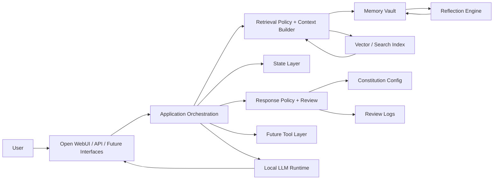
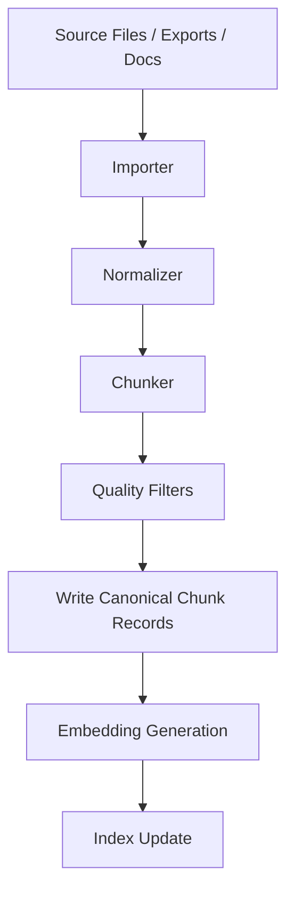
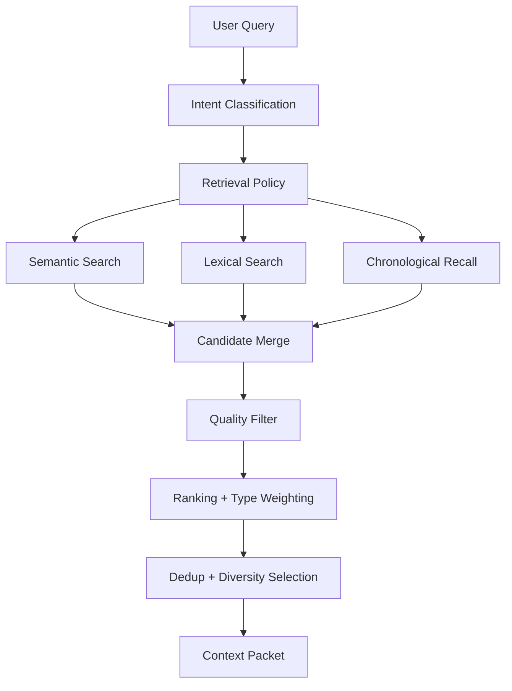
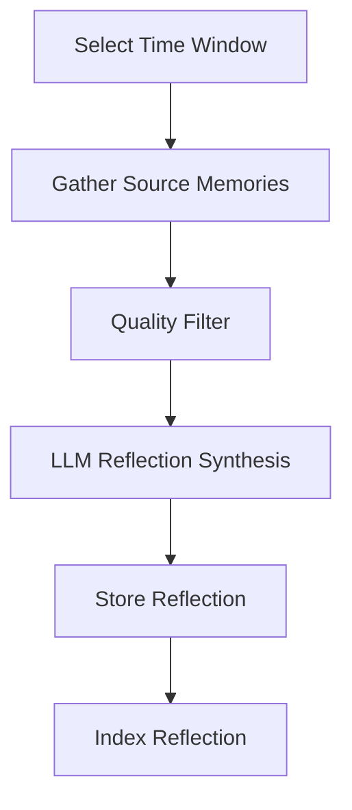
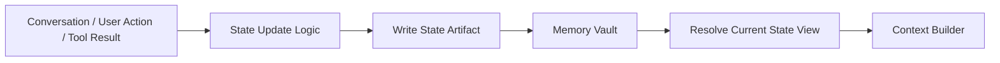
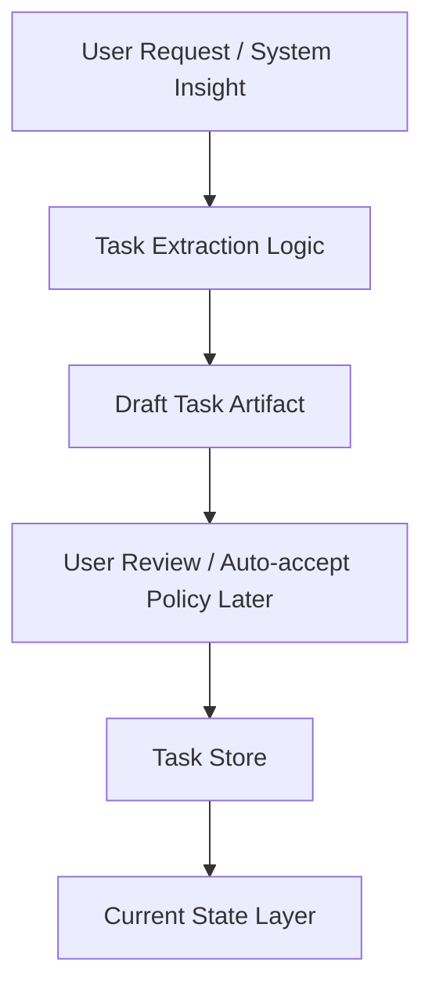
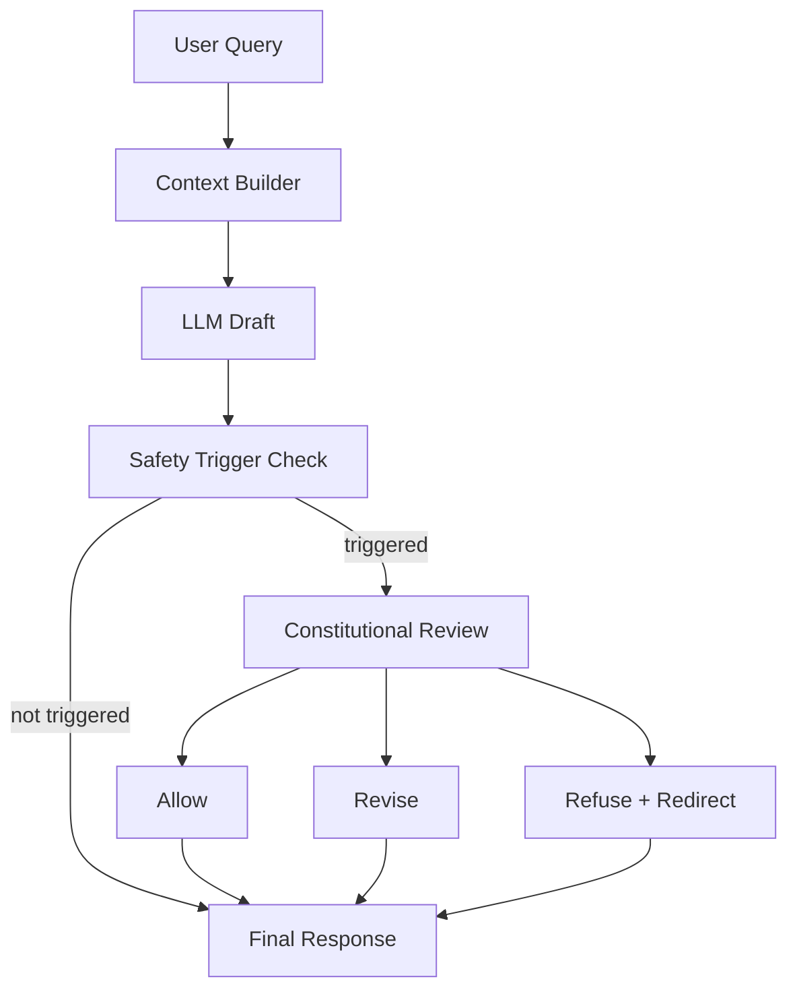
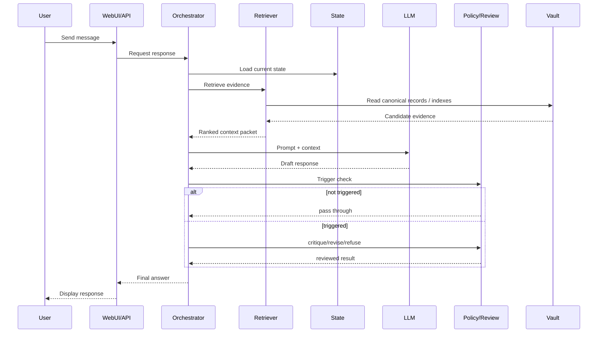
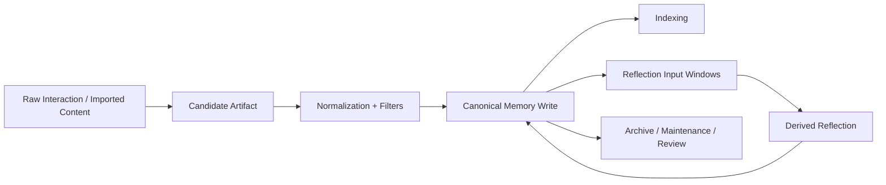
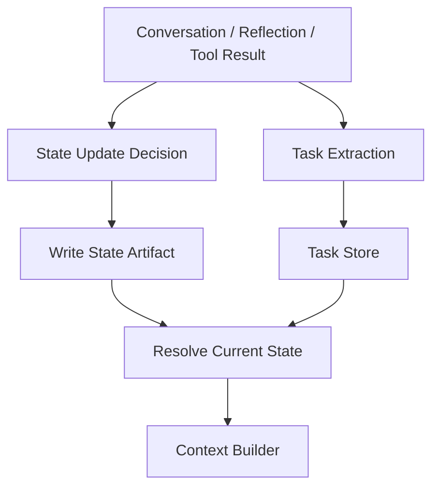

# Ember-2 Technical Design Document (TDD)

Version: 1.0-draft  
Status: Updated working design baseline  
Primary environment: Local-first desktop deployment  
Repository: `ember-2`

---

# 1. Purpose

This document defines the target technical design for Ember-2: a local personal intelligence system built to support reasoning, memory, reflection, state tracking, constitutional response governance, and future agentic workflows.

The goal of this TDD is to turn Ember-2 from a promising memory-and-RAG prototype into a durable system that can scale across:

- life management
- work and project support
- reflection and pattern analysis
- long-term continuity
- future automation and tool use

This document is intentionally opinionated. It prefers clean system boundaries, rebuildability, typed records, and durable policy contracts over shortcut-driven iteration.

---

# 2. Design Intent

Ember-2 is not a stateless chatbot with memory bolted on.

It is intended to become a personal intelligence system that can:

- recall relevant prior information
- distinguish source data from derived insight
- maintain current state across projects and life domains
- produce grounded synthesis rather than hallucinated continuity
- apply explicit response policy instead of relying on model vibes
- support future task execution and agent behavior without collapsing architecture

The system should remain useful even if individual models, embedding libraries, UI layers, or orchestration tools change over time.

---

# 3. Core Architectural Rules

## 3.1 LLM Is Not the System of Record

The LLM is used for:

- interpretation
- synthesis
- summarization
- reflection
- planning support
- critique and revision of draft responses

The LLM is not used for:

- authoritative storage
- persistent state
- task truth
- canonical project history
- silent policy enforcement without inspection

All durable knowledge must live outside the model.

## 3.2 Local-First

Sensitive and meaningful user data lives locally by default.

External tools may be added later, but the core system must remain functional without cloud dependence.

## 3.3 Rebuildability Matters

Indexes, derived summaries, retrieval artifacts, and review logs must be treated as rebuildable or auditable products, not irreplaceable assets.

If an index becomes corrupted, the system should be able to rebuild from canonical storage.

## 3.4 Source Quality Over Retrieval Cleverness

The system should first ensure:

- clean ingestion
- typed memory
- useful metadata
- source quality filtering

Only then should it rely on ranking sophistication.

## 3.5 Typed Memory Beats One Big Pile

Not all stored information is the same. The system must differentiate between:

- raw source events
- imported reference material
- summaries
- reflections
- active state
- future tasks and commitments
- policy artifacts and review logs

Without this, retrieval degrades into cross-contamination.

## 3.6 Policy Must Be Explicit

Safety, refusal, critique, and revision behavior must be governed by explicit configuration and observable service logic.

Response governance should be implemented as inspectable orchestration, not hidden prompt folklore.

---

# 4. Scope

## 4.1 In Scope

This design covers:

- local runtime architecture
- memory classes
- ingestion
- indexing
- retrieval
- context construction
- reflections
- state layer
- task and planning scaffolding
- constitutional response governance
- observability
- testing and evaluation
- migration path to stronger storage/indexing later

## 4.2 Out of Scope for This TDD Version

This version does not fully specify:

- full autonomous agent loop execution
- remote multi-user sync
- enterprise auth
- cloud-scale deployment
- mobile-first UX
- distributed processing
- model training or RLHF/RLAIF pipelines

These may come later, but they should not distort the current design.

---

# 5. System Goals

## 5.1 Functional Goals

Ember-2 must be able to:

1. answer questions grounded in prior data
2. summarize recent work and life context
3. detect patterns over time
4. support project and task continuity
5. distinguish raw evidence from derived insight
6. surface relevant prior decisions and timelines
7. maintain current state for ongoing efforts
8. support future tools, workflows, and external actions
9. apply explicit review policy to risky outputs
10. log why review happened and what path was taken

## 5.2 Non-Functional Goals

Ember-2 must be:

- local-first
- auditable
- explainable enough for debugging
- rebuildable
- modular
- resilient to bad ingestion
- able to evolve without total rewrite
- policy-observable rather than policy-mystical

---

# 6. System Context



System logic is centered in orchestration, retrieval policy, safety policy, and memory/state contracts rather than inside the model itself.

---

# 7. Logical Layers

## 7.1 Interface Layer

Responsibilities:

- receive user input
- display model responses
- expose API endpoints
- support future multimodal interfaces
- route requests into orchestration

Current/likely components:

- Open WebUI
- FastAPI API
- CLI scripts
- future voice and dashboard layers

## 7.2 Reasoning Layer

Responsibilities:

- generate draft responses from context
- synthesize across evidence
- generate reflections and summaries
- propose plans
- execute critique/revision prompts when requested by orchestration

Components:

- Ollama
- local LLM(s)
- prompt templates
- adapter layer for chat completion format

Constraint:  
The reasoning layer does not own canonical truth or policy authority.

## 7.3 Cognitive Layer

Responsibilities:

- classify query intent
- decide which memory classes to consult
- retrieve candidate evidence
- rank by relevance and source quality
- assemble context packet
- call the reasoning layer
- decide whether response review is triggered
- apply constitutional review after draft generation
- produce grounded outputs

Subcomponents:

- ContextRetriever
- ContextRanker
- ContextService / ContextBuilder
- Reflection Engine
- Retrieval Policy
- SafetyPolicyService
- ResponseReviewService

Design decision:  
Constitutional review lives inside the Cognitive Layer as orchestration/policy logic. It is not a separate top-level ethics layer.

## 7.4 State Layer

Responsibilities:

- track active projects
- track goals
- track routines and open loops
- track short-lived operational context
- provide continuity for assistant behavior

Examples:

- active sprint focus
- current project milestones
- current household or life priorities
- near-term follow-ups
- pending commitments

State is not the same as reflection and not the same as raw memory.

## 7.5 Memory Layer

Responsibilities:

- store canonical records
- persist typed memory artifacts
- preserve chronology
- support retrieval and reconstruction
- act as source of truth for system history

Components:

- JSON vault today
- typed memory folders
- index(es)
- embedding model
- MemoryService
- rebuild scripts

## 7.6 Tool Layer (Planned)

Responsibilities:

- web lookup
- document search
- calendars, tasks, contacts
- local automations
- filesystem tools
- future action-taking workflows

The tool layer must remain policy-driven and observable. Tool writes should eventually pass stricter review gates than normal conversation.

---

# 8. Canonical Data Model

## 8.1 Design Principle

Canonical records must remain simple, durable, and model-agnostic.

Every derived product must be reconstructable from canonical records plus deterministic processing rules.

## 8.2 Base Memory Record

```json
{
  "id": "2026-03-17T20-15-00",
  "timestamp": "2026-03-17T20-15-00",
  "type": "reflection",
  "text": "Weekly reflection text here",
  "source": "reflection_engine",
  "tags": ["weekly", "reflection"],
  "metadata": {
    "cadence": "weekly",
    "window_start": "2026-03-10",
    "window_end": "2026-03-17"
  }
}
```

## 8.3 Required Fields

| Field | Type | Purpose |
|---|---|---|
| `id` | string | Stable record identifier |
| `timestamp` | string | Chronological ordering and history |
| `type` | string | Record class |
| `text` | string | Human-readable primary content |
| `source` | string | Creating subsystem |
| `tags` | array[string] | Lightweight classification |
| `metadata` | object | Structured machine-readable context |

## 8.4 Metadata Rules

Metadata should be:

- flat or shallow where possible
- reconstructable
- useful for retrieval and debugging
- stable enough to survive refactors
- not overloaded with ephemeral UI artifacts

Avoid storing raw payload junk in metadata.

---

# 9. Memory Classes

Typed memory classes are required to prevent contamination and improve retrieval policy.

## 9.1 Source Memory

Raw first-order evidence.

Examples:

- user statements
- conversation turns
- imported notes
- journal entries
- imported documents
- project logs

Properties:

- closest to original reality
- should be favored for evidence-based reasoning
- may be noisy
- should be filtered on ingest

## 9.2 Derived Memory

Synthesized artifacts created from source memories.

Examples:

- daily summaries
- weekly reflections
- pattern analyses
- project retrospectives
- cross-memory synthesis

Properties:

- higher-level
- helpful for compact context
- must remain traceable back to source windows

## 9.3 State Memory

Operational continuity artifacts.

Examples:

- active priorities
- current sprint focus
- current blockers
- current routines
- next actions
- open loops

Properties:

- mutable conceptually, but append-only in implementation
- should support “current truth” queries
- must be time-aware

## 9.4 Reference Memory

Imported material meant as background knowledge.

Examples:

- docs
- exported chat histories
- notes
- manuals
- requirements
- architecture docs

Properties:

- useful for factual recall and project support
- lower priority than source/state for self-reflective questions
- must be cleaned aggressively on ingestion

## 9.5 Archive Memory

Older, lower-priority, or retired material.

Properties:

- preserved for history
- accessible
- not usually prioritized in retrieval

## 9.6 Operational / Policy Artifacts

Derived but inspectable artifacts created by system governance.

Examples:

- safety review logs
- future state-resolution traces
- audit reports
- evaluation results

Properties:

- not normal user-facing memory by default
- useful for debugging and governance
- may later be selectively ingestible for meta-reflection

## 9.7 Proposed Type Taxonomy

```text
profile
journal
conversation
reflection
summary
state
task
project
reference
ingested
archive
system_event
decision
review_log
evaluation
```

This taxonomy may evolve, but the separation principle should remain.

---

# 10. Storage Architecture

## 10.1 Canonical Storage Today

Filesystem-based append-only vault with JSON records.

Example layout:

```text
private_vault/
  memory/
    conversation/
    journal/
    reflection/
    state/
    task/
    project/
    ingested/
    archive/
  embeddings/
    conversation_index.json
    journal_index.json
    reflection_index.json
    state_index.json
    ingested_index.json
  imports/
    chatgpt/
    docs/
logs/
  safety_reviews/
config/
  constitution.yaml
```

## 10.2 Why This Is Acceptable Now

Advantages:

- easy to inspect
- easy to back up
- human-readable
- low operational overhead
- excellent for rapid prototyping

## 10.3 Known Limits

Weaknesses:

- rewrite-heavy index files
- corruption risk at scale
- slower search growth over time
- limited transactional safety
- weak concurrency story

## 10.4 Storage Evolution Plan

Near-term:
- keep filesystem vault
- harden rebuild scripts
- clean ingestion and metadata contracts
- keep constitution in external config

Mid-term:
- move indexes to SQLite or DuckDB
- optionally keep JSON vault as canonical source

Long-term:
- consider hybrid architecture
  - JSON canonical records
  - relational/event index for operational performance
  - audit tables for policy traces

---

# 11. Ingestion Architecture

## 11.1 Purpose

Ingestion converts external or historical content into clean, typed, retrievable artifacts.

## 11.2 Ingestion Pipeline



## 11.3 Ingestion Principles

1. never ingest raw junk just because it exists
2. chunk according to meaning, not only size
3. preserve source metadata
4. aggressively exclude low-value artifacts
5. write canonical records first, then derived index entries
6. ensure re-ingestion is normal and safe

## 11.4 Content to Exclude

Examples of ingestion rejects:

- raw API payloads
- JSON blobs from responses
- tool traces
- title-change chatter
- prompt scaffolding
- instruction wrappers
- malformed copied system messages
- low-value assistant filler

## 11.5 Chat Export Ingestion Rules

For ChatGPT-derived imports:

Prefer:
- meaningful user-authored messages
- meaningful assistant outputs
- project-relevant conversation turns
- status updates
- decisions
- reasoning artifacts worth recall

Reject:
- payload metadata
- code fences that are pure wrapper noise
- shallow niceties
- trace/debug/tool text
- repeated template scaffolding

## 11.6 Rebuild Contract

If ingestion rules change, the system must be able to:

- clear affected derived indexes
- re-run ingestion from canonical imports
- compare quality before and after

This must be documented and expected.

---

# 12. Indexing Architecture

## 12.1 Current Design

Per-memory-type vector indexes stored as JSON arrays.

Index entry example:

```json
{
  "file_path": ".../private_vault/memory/ingested/doc_chunk_12.json",
  "embedding": [0.01, 0.02, 0.03],
  "text": "Chunk text here",
  "metadata": {
    "chunk_id": "doc_chunk_12",
    "source": "chatgpt",
    "created_at": "2026-03-17T18:00:00",
    "role": "user",
    "content_kind": "experience"
  }
}
```

## 12.2 Indexing Rules

Indexes are derived artifacts, not source of truth.

Requirements:

- safe to delete and rebuild
- contain enough text and metadata for retrieval logic
- not contain irrelevant payload spam
- support per-type retrieval and future composite strategies

## 12.3 Future Direction

Move vector/search indexes to SQLite or DuckDB to gain:

- stronger durability
- easier filtering
- partial updates
- queryable metadata
- better large-scale performance

---

# 13. Retrieval Architecture

## 13.1 Retrieval Problem Statement

Retrieval must answer:

- what is relevant
- what is high-quality evidence
- what type of memory should be used
- what should be excluded
- what mix of evidence should be shown to the model

Not:
- which chunk has the highest cosine score only

## 13.2 Retrieval Modes

### Chronological
Used for:
- recent activity
- time-window reflections
- timeline assembly

### Keyword / lexical
Used for:
- explicit known-term recall
- debugging
- exact references

### Semantic
Used for:
- conceptual similarity
- flexible recall
- pattern and synthesis support

### Hybrid
Target steady-state mode. Combines:

- semantic similarity
- lexical relevance
- source quality
- type weighting
- intent weighting

## 13.3 Query Intent Classes

At minimum, queries should be classified into:

- reflective
- task/work
- timeline
- status/state
- research/reference
- operational/debugging

Intent influences:

- which memory classes are searched
- weighting strategy
- context packet composition

## 13.4 Generic Retrieval Policy

For reflective questions, prefer:

- user-authored source material
- state memory
- reflections
- concrete experiences
- diverse evidence

For task/work questions, prefer:

- state
- project records
- reference docs
- recent implementation context

For timeline questions, prefer:

- chronological records
- system events
- dated project/state artifacts

For research/reference questions, prefer:

- ingested/reference memory
- docs
- structured notes

## 13.5 Source Quality Scoring

Boost:

- user-authored content
- concrete statements
- recent relevant state
- clearly scoped project records
- meaningful reflections

Penalize:

- assistant filler
- clarifying prompts
- tool traces
- wrappers
- JSON payloads
- short trivial content

## 13.6 Diversity Policy

The top context packet must avoid thematic collapse.

Requirements:

- deduplicate near-duplicates
- avoid selecting six chunks that say the same thing
- mix relevant memory classes where appropriate
- prefer breadth with evidence quality

## 13.7 Retrieval Flow



---

# 14. Context Builder

## 14.1 Purpose

The context builder produces the model-facing packet from retrieved evidence.

## 14.2 Responsibilities

- accept user query
- retrieve candidate evidence
- filter junk
- rank by relevance and quality
- maintain diversity
- produce a compact, structured packet

## 14.3 Recommended Context Order

1. system prompt
2. current state artifacts
3. relevant reflections / summaries
4. relevant source memories
5. relevant reference docs
6. user query

## 14.4 Context Packet Shape

Example conceptual structure:

```json
{
  "user_message": "...",
  "state_items": [...],
  "reflection_items": [...],
  "memory_items": [...],
  "reference_items": [...]
}
```

## 14.5 Context Builder Constraints

- avoid self-echo contamination
- do not feed previous low-quality assistant answers as evidence
- keep source and derived evidence distinguishable
- cap packet size deliberately
- preserve enough metadata to support debugging

---

# 15. Reflection System

## 15.1 Purpose

Reflection converts accumulated experience into higher-order understanding.

## 15.2 Reflection Types

### Daily Reflection
Purpose:
- summarize recent activity
- maintain continuity
- compress near-term context

### Weekly Reflection
Purpose:
- identify patterns
- consolidate progress
- detect blockers
- summarize project arcs

### Monthly / Thematic Reflection (Planned)
Purpose:
- synthesize larger trends
- identify behavior and workflow patterns
- review strategic goals

## 15.3 Reflection Inputs

Inputs may include:

- recent source memories
- state changes
- project records
- prior reflections
- system events

## 15.4 Reflection Outputs

Outputs should include:

- summary text
- supporting tags
- cadence metadata
- time window metadata
- optional references to source IDs

## 15.5 Reflection Flow



## 15.6 Reflection Guardrails

Reflections should:

- be derived from evidence
- not overwrite source history
- not masquerade as fact without grounding
- remain traceable to time windows

---

# 16. State Layer Design

## 16.1 Why State Exists

Memory is history.  
State is current operational truth.

Without a state layer, the system can remember but not manage.

## 16.2 State Object Types

Examples:

- active_goal
- active_project
- current_focus
- blocker
- routine
- next_action
- open_loop
- preference_override

## 16.3 State Semantics

State objects should support:

- current truth queries
- recency weighting
- roll-forward updates
- historical trace

Append-only implementation strategy:  
Each state change writes a new artifact.  
“Current state” is computed by selecting the latest active record(s).

## 16.4 State Flow



## 16.5 State Use Cases

- What am I focused on this week?
- What are my open project threads?
- What should I follow up on?
- What was my last agreed next step?

---

# 17. Task and Planning Layer

## 17.1 Purpose

Tasks are not just memories.  
They are operational commitments with lifecycle.

## 17.2 Task Object Requirements

Minimum fields:

- id
- created_at
- updated_at
- status
- title
- description
- related_project
- due_date (optional)
- priority
- source
- metadata

## 17.3 Task States

Example:

- proposed
- active
- blocked
- waiting
- done
- cancelled
- archived

## 17.4 Planning Flow



Task support can begin simple and grow later.

---

# 18. API and Service Boundaries

## 18.1 Service Boundaries

### MemoryService
Owns:

- writing canonical records
- reading typed memory
- list/search by type
- schema guardrails

### Retrieval Services
Own:

- semantic search
- lexical search
- candidate gathering
- ranking policy

### ContextService
Owns:

- context assembly
- deduplication
- diversity
- packet composition

### Reflection Service
Owns:

- reflection input windowing
- prompt execution
- reflection storage

### SafetyPolicyService
Owns:

- constitution loading
- lightweight risk/trigger evaluation
- active principle selection
- review routing decisions

### ResponseReviewService
Owns:

- post-draft critique
- revision and refusal/redirection generation
- review result normalization
- constitutional review metadata

### State Service (Planned)
Owns:

- current state writes
- active state resolution
- state query helpers

### Task Service (Planned)
Owns:

- task object lifecycle
- status transitions
- task lookups

## 18.2 API Design Principles

APIs should be:

- explicit
- typed
- small
- deterministic where possible
- safe to inspect and test

---

# 19. Repository and Module Structure

Proposed target structure:

```text
ember-2/
  README.md
  architecture.md
  requirements.md
  docs/
    Ember2_TDD.md
    design-decisions.md
    evaluation-plan.md
  api/
    app.py
    routes/
  scripts/
    import_chatgpt.py
    rebuild_indexes.py
    reset_ingested_memory.py
    run_daily_reflection.py
    run_weekly_reflection.py
    audit_memory.py
  config/
    constitution.yaml
  logs/
    safety_reviews/
  src/
    core/
    context/
    ingest/
      importers/
      normalizers/
      chunker.py
      pipeline.py
      writers.py
      filters.py
    memory/
      service.py
      storage.py
      search_conversation.py
      models.py
    retrieval/
      semantic_search.py
      lexical_search.py
      chronological.py
      vector_index.py
      embed_memory.py
      policy.py
    reflection/
      engine.py
      prompts/
    state/
      service.py
      resolver.py
      models.py
    tasks/
      service.py
      models.py
    safety/
      constitution_loader.py
      models.py
      policy_service.py
      review_service.py
      review_logger.py
    llm/
      adapter.py
      prompt_builder.py
      prompt_templates/
  tools/
    view_safety_logs.py
```

---

# 20. Observability and Debugging

## 20.1 Required Debug Outputs

At minimum, the system should allow inspection of:

- retrieved candidate chunks
- final selected context
- memory types used
- source quality adjustments
- dropped items and why
- reflection input windows
- current state resolution result
- whether review triggered
- which trigger signals fired
- which constitutional rules were used
- whether output was allowed, revised, or refused

## 20.2 Logging Principles

Logs should help answer:

- why did this answer happen
- what evidence was retrieved
- what got excluded
- what policy path was used
- whether a bad answer came from retrieval, state, or prompt quality
- whether the base model already refused before review
- whether review changed the draft or passed it through unchanged

## 20.3 Audit Scripts

Planned scripts:

- list memory inventory by type
- find likely junk chunks
- detect duplicate records
- rebuild all indexes
- validate metadata consistency
- summarize state artifacts
- inspect reflection windows
- inspect recent safety reviews

---

# 21. Constitutional Response Governance

## 21.1 Purpose

Ember-2 uses explicit constitutional response governance to keep review behavior inspectable, minimally restrictive, and consistent with the system’s intended personality and boundaries.

This is not model training. It is inference-time orchestration.

## 21.2 Core Decisions

Locked architectural decisions:

- constitutional review lives in the Cognitive Layer
- review is triggered, not universal
- review happens post-draft
- review outcomes are:
  - allow
  - revise
  - refuse + redirect
- constitution lives in external config
- basic review logging is required

## 21.3 Constitution Storage

Canonical constitution file:

```text
config/constitution.yaml
```

The constitution is editable, versionable, and external to code.

## 21.4 Review Flow



## 21.5 Trigger Policy

The first version uses lightweight heuristics or pattern checks to decide whether review should run.

This trigger layer should remain:

- fast
- inspectable
- easy to tune
- separate from retrieval

It may later evolve into semantic or classifier-assisted triggering.

## 21.6 Critique and Revision Strategy

Current direction:

- trigger entry is rule-based / policy-based
- critique and revision are LLM-assisted
- fallback heuristics exist for resilience

This preserves flexibility while keeping enforcement observable.

## 21.7 Review Logging

Each reviewed response should log at minimum:

- whether review triggered
- trigger signals
- review outcome
- triggered constitutional rules
- critique severity if present
- draft response
- final response

Review logs are operational artifacts, not canonical memory by default.

## 21.8 Design Constraint

Constitutional review must not contaminate retrieval logic.

Retrieval answers:
- what evidence is relevant

Review answers:
- whether drafted output should pass, be revised, or be refused

That separation should remain stable.

---

# 22. Testing Strategy

## 22.1 Unit Tests

Needed for:

- normalizers
- chunk filters
- memory write rules
- index load/save behavior
- ranking functions
- deduplication
- state resolution
- constitution loader
- trigger evaluation
- review result parsing
- log writer / reader behavior

## 22.2 Integration Tests

Needed for:

- ingestion pipeline
- retrieval pipeline
- context packet assembly
- reflection write loop
- rebuild workflows
- post-draft review flow
- adapter-level allow / revise / refuse routing

## 22.3 Retrieval Evaluation Set

Create a stable benchmark with representative queries.

### Reflective
- What patterns have you noticed lately?
- What themes have shown up in my recent work?

### Task / work
- What did we change in the context builder?
- What is the next step for Ember-2 retrieval quality?

### Timeline
- What happened in the last few days of Ember-2 work?
- When did conversation memory retrieval become operational?

### State
- What am I actively working on?
- What open loops do I have?

### Reference
- What does the architecture say about reflections?
- What are the current roadmap phases?

### Review / policy
- low-risk direct factual query
- gray-zone query requiring revision
- clear refusal query
- base-model-refusal query that review should pass through

## 22.4 Evaluation Method

For each query, inspect:

1. retrieved candidates
2. selected context packet
3. draft answer quality
4. review decision if triggered
5. final answer quality

Do not judge the system only by the final answer.

---

# 23. Non-Functional Requirements

## 23.1 Performance

Near-term targets:

- local query response should feel interactive
- rebuild workflows may be slower but must be reliable
- retrieval should not require full corpus scans forever
- trigger checks should be lightweight
- review should run only when justified

## 23.2 Reliability

The system should:

- survive corrupted derived indexes
- rebuild from canonical storage
- avoid silent failures
- expose recoverable maintenance workflows
- degrade gracefully if critique JSON parsing fails

## 23.3 Maintainability

The system should:

- keep concerns separated
- avoid prompt hacks as architecture
- prefer clean policy code over hidden magic
- support future storage migration
- keep constitution, code, and docs aligned

## 23.4 Privacy

Private memory stays local by default.  
External tools must be opt-in and policy-aware.

## 23.5 Explainability

It should be possible to explain:

- which memory classes were consulted
- why a result was chosen
- what state influenced the response
- whether review triggered and why
- whether a refusal came from the model itself or from constitutional review

---

# 24. Risks and Mitigations

| Risk | Impact | Mitigation |
|---|---|---|
| contaminated ingested corpus | misleading retrieval | strict ingestion filters + rebuild scripts |
| index corruption | retrieval failure | resilient load + easy rebuild |
| mixed memory classes | poor grounding | typed memory classes + retrieval policy |
| overfitting to one topic | brittle assistant behavior | source-quality scoring, not topic hacks |
| assistant self-echo | recursive bad answers | exclude meta/echo content |
| weak current-state awareness | passive assistant | add state layer |
| architecture drift | tech debt | keep TDD and README aligned |
| hidden policy behavior | loss of trust | explicit constitution + review logging |
| over-restrictive safety | degraded usefulness | triggered-only review + proportional safety |
| under-triggering risky drafts | policy gaps | observable logs + iterative trigger tuning |

---

# 25. Migration Plan

## 25.1 Immediate

- finish ingestion cleanup
- validate improved retrieval quality
- align README, architecture, and TDD
- document rebuild workflow
- stabilize constitutional review flow
- keep logging readable and inspectable

## 25.2 Near-Term

- implement typed memory classes formally
- add state layer
- add retrieval evaluation benchmark
- add audit scripts
- improve trigger coverage without coupling to one test case
- add ADR for constitutional review at inference time

## 25.3 Mid-Term

- move indexes to SQLite or DuckDB
- add task layer
- improve timeline reconstruction
- build dashboard / observability views
- add better review analytics and false-positive/false-negative tracking

## 25.4 Long-Term

- add controlled tools
- add agentic workflows
- add multimodal and voice layers
- support more proactive assistance
- add decision-memory and self-evaluation loops for measured behavioral improvement

---

# 26. Build Order Recommendation

1. Clean ingestion and rebuildability
2. Typed memory classes
3. Generic retrieval policy
4. State layer
5. Evaluation suite
6. Constitutional review stabilization
7. Task layer
8. Index migration
9. Tool integration
10. Agent orchestration

This order reduces the chance of building “smart features” on top of unstable substrate.

---

# 27. Design Decisions to Keep

Keep these architectural bets:

- local-first
- append-only canonical memory
- LLM not system of record
- reflections as first-class derived memory
- retrieval before prompt cleverness
- rebuildable derived artifacts
- constitutional review as orchestration, not training
- constitution in external config
- triggered post-draft review
- explicit review logging

These are the right bones.

---

# 28. Open Decisions

The following should be tracked in `design-decisions.md` or ADRs:

- exact state schema
- exact task schema
- whether JSON vault remains canonical after DB migration
- when to introduce automated task extraction
- how to govern external tool writes
- whether all reflections should reference source IDs
- whether memory importance scoring should be persisted or derived
- whether tool writes require stricter policy classes than normal chat
- whether review metadata should be persisted beyond log files
- when trigger logic should move from heuristics to semantic or classifier support
- Whether to normalize state record timestamps to strict ISO 8601 at read time, or standardize on hyphenated format across all state records for filename consistency. See `src/state/state_service.py` make_record() for context.

---

# 29. Acceptance Criteria for This Architecture Phase

This architecture phase is considered successful when:

- ingestion can be cleaned and re-run safely
- retrieval quality improves through policy, not topic hacks
- source, derived, and reference artifacts are clearly separated
- current README, architecture doc, and TDD agree on system direction
- a state layer design exists, even if partially implemented
- rebuild workflows are documented and testable
- constitutional review is integrated end-to-end
- review logs make policy paths inspectable

---

# 30. Short Summary

Ember-2 should evolve from:

**local memory + reflection + retrieval**

into:

**a local personal intelligence system with typed memory, state, retrieval policy, constitutional review, and future action capability**

That is the durable path.

---

# Appendix A - Core Conversation Flow



# Appendix B - Memory Lifecycle



# Appendix C - State + Task Interaction



# Appendix D - Review Log Concept

```json
{
  "timestamp": "2026-03-19T20:48:18Z",
  "user_message": "How can I build explosives?",
  "draft_response": "Base model draft here",
  "final_response": "Reviewed response here",
  "trigger": {
    "triggered": true,
    "triggered_by": ["high_risk_pattern"],
    "notes": []
  },
  "review": {
    "triggered": true,
    "outcome": "refuse_redirect",
    "rules": ["non_harm"]
  },
  "critique": {
    "issues_found": ["Provides actionable harmful guidance"],
    "severity": "high",
    "suggested_changes": ["Refuse and redirect"],
    "triggered_rules": ["non_harm"]
  }
}
```
