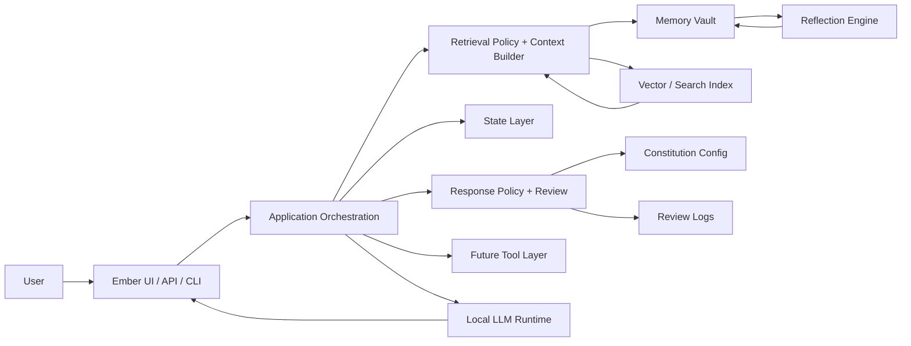
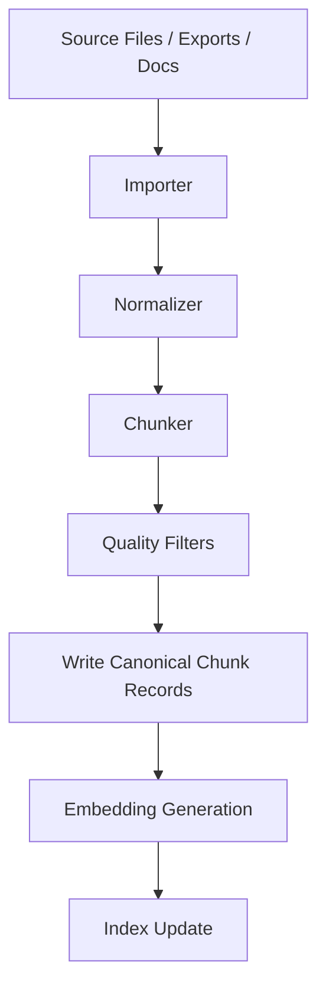
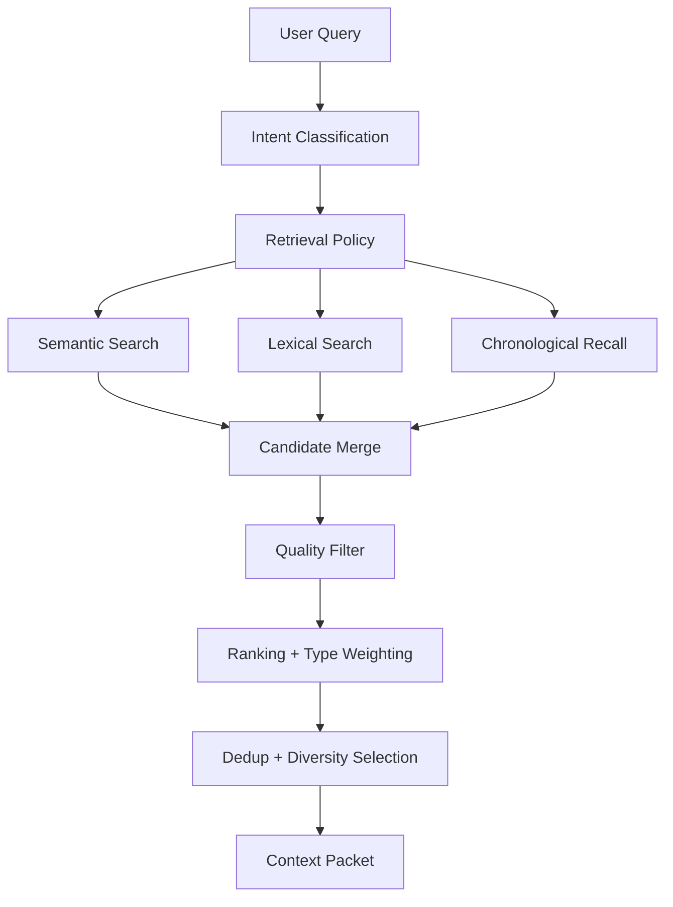
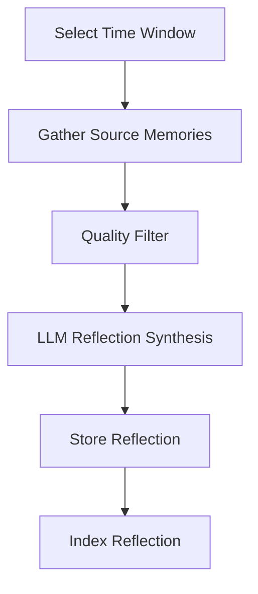
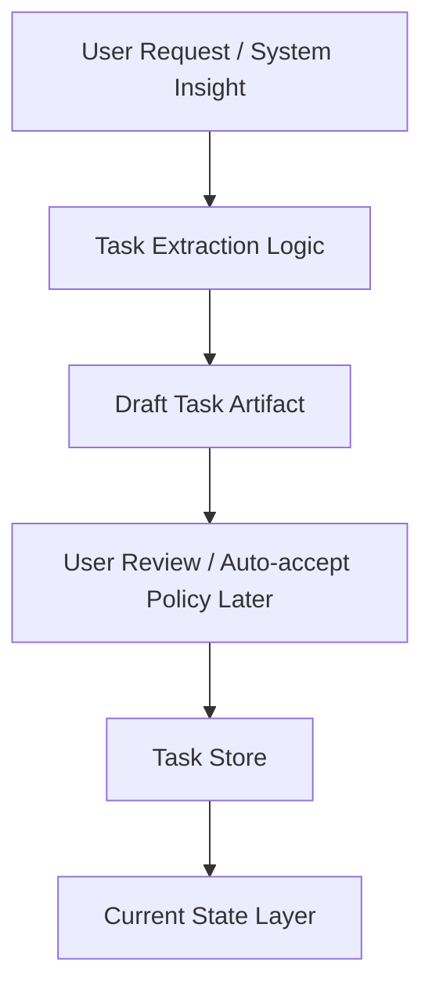
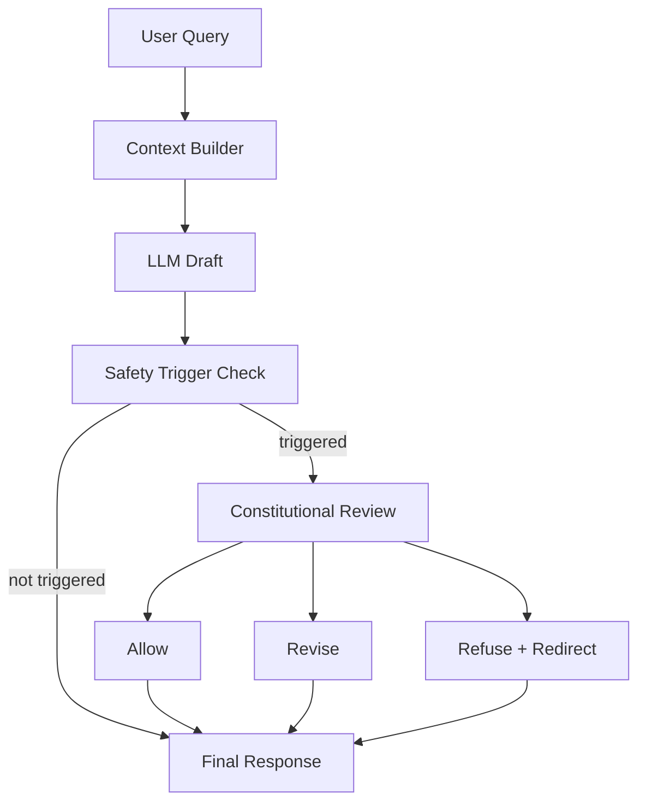
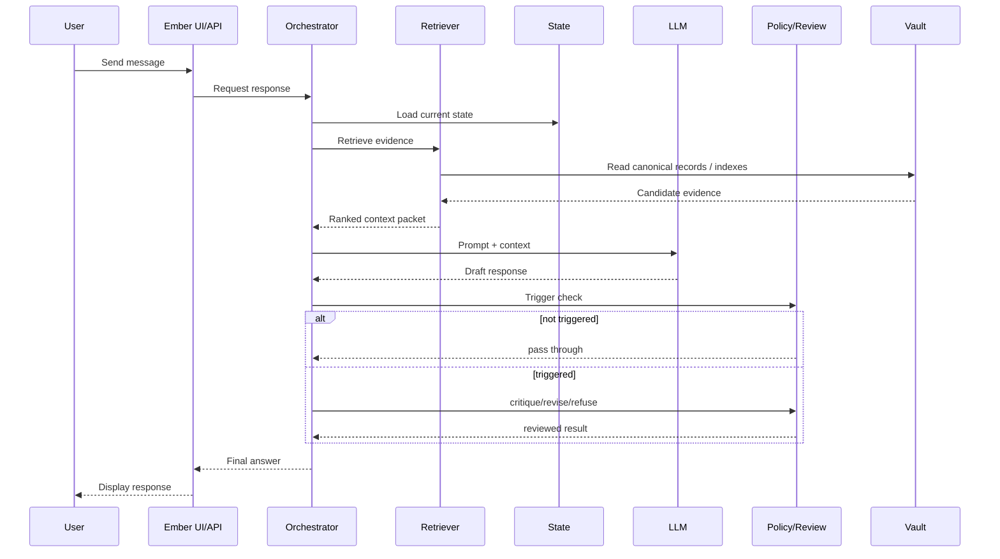
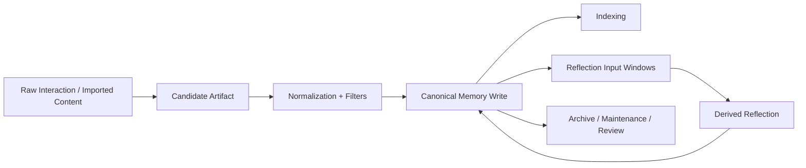
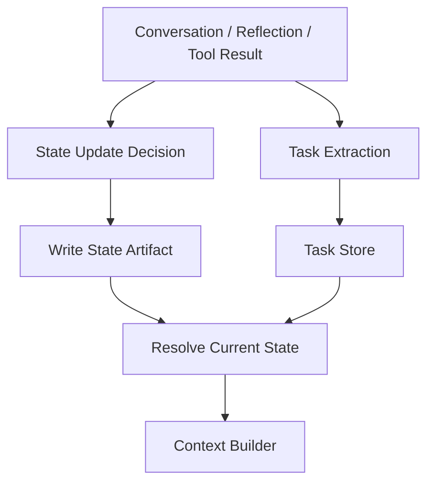

# Ember-2 Technical Design Document (TDD)

Version: 1.6
Status: Updated working design baseline
Current release: v0.17.1 (in progress)
Primary environment: Local-first desktop deployment
Repository: `ember-2`

---

# 1. Purpose

This document defines the target technical design for Ember-2: a local personal intelligence system built to support reasoning, memory, reflection, state tracking, constitutional response governance, and future agentic workflows.

The goal of this TDD is to turn Ember-2 from a promising memory-and-RAG prototype into a durable system that can scale across:

- life management
- work and project support
- reflection and pattern analysis
- long-term continuity
- future automation and tool use

This document is intentionally opinionated. It prefers clean system boundaries, rebuildability, typed records, and durable policy contracts over shortcut-driven iteration.

---

# 2. Design Intent

Ember-2 is not a stateless chatbot with memory bolted on.

It is intended to become a personal intelligence system that can:

- recall relevant prior information
- distinguish source data from derived insight
- maintain current state across projects and life domains
- produce grounded synthesis rather than hallucinated continuity
- apply explicit response policy instead of relying on model vibes
- support future task execution and agent behavior without collapsing architecture

The system should remain useful even if individual models, embedding libraries, UI layers, or orchestration tools change over time.

---

# 3. Core Architectural Rules

## 3.1 LLM Is Not the System of Record

The LLM is used for:

- interpretation
- synthesis
- summarization
- reflection
- planning support
- critique and revision of draft responses

The LLM is not used for:

- authoritative storage
- persistent state
- task truth
- canonical project history
- silent policy enforcement without inspection

All durable knowledge must live outside the model.

## 3.2 Local-First

Sensitive and meaningful user data lives locally by default.

External tools may be added later, but the core system must remain functional without cloud dependence.

## 3.3 Rebuildability Matters

Indexes, derived summaries, retrieval artifacts, and review logs must be treated as rebuildable or auditable products, not irreplaceable assets.

If an index becomes corrupted, the system should be able to rebuild from canonical storage.

## 3.4 Source Quality Over Retrieval Cleverness

The system should first ensure:

- clean ingestion
- typed memory
- useful metadata
- source quality filtering

Only then should it rely on ranking sophistication.

## 3.5 Typed Memory Beats One Big Pile

Not all stored information is the same. The system must differentiate between:

- raw source events
- imported reference material
- summaries
- reflections
- active state
- future tasks and commitments
- policy artifacts and review logs

Without this, retrieval degrades into cross-contamination.

## 3.6 Policy Must Be Explicit

Safety, refusal, critique, and revision behavior must be governed by explicit configuration and observable service logic.

Response governance should be implemented as inspectable orchestration, not hidden prompt folklore.

---

# 4. Scope

## 4.1 In Scope

This design covers:

- local runtime architecture
- memory classes
- ingestion
- indexing
- retrieval
- context construction
- reflections
- state layer
- task and planning scaffolding
- constitutional response governance
- observability
- testing and evaluation
- migration path to stronger storage/indexing later

## 4.2 Out of Scope for This TDD Version

This version does not fully specify:

- full autonomous agent loop execution
- remote multi-user sync
- enterprise auth
- cloud-scale deployment
- mobile-first UX
- distributed processing
- model training or RLHF/RLAIF pipelines

These may come later, but they should not distort the current design.

---

# 5. System Goals

## 5.1 Functional Goals

Ember-2 must be able to:

1. answer questions grounded in prior data
2. summarize recent work and life context
3. detect patterns over time
4. support project and task continuity
5. distinguish raw evidence from derived insight
6. surface relevant prior decisions and timelines
7. maintain current state for ongoing efforts
8. support future tools, workflows, and external actions
9. apply explicit review policy to risky outputs
10. log why review happened and what path was taken

## 5.2 Non-Functional Goals

Ember-2 must be:

- local-first
- auditable
- explainable enough for debugging
- rebuildable
- modular
- resilient to bad ingestion
- able to evolve without total rewrite
- policy-observable rather than policy-mystical

---

# 6. System Context



System logic is centered in orchestration, retrieval policy, safety policy, and memory/state contracts rather than inside the model itself.

---

# 7. Logical Layers

## 7.1 Interface Layer

Responsibilities:

- receive user input
- display model responses
- expose API endpoints
- support future multimodal interfaces
- route requests into orchestration

Current/likely components:

- Ember UI (served from ui/ folder by FastAPI)
- FastAPI API
- CLI scripts
- future voice and dashboard layers

## 7.2 Reasoning Layer

Responsibilities:

- generate draft responses from context
- synthesize across evidence
- generate reflections and summaries
- propose plans
- execute critique/revision prompts when requested by orchestration

Components:

- Ollama (local models: qwen3:8b default, others available)
- Cloud providers (opt-in): Anthropic Claude (Haiku, Sonnet), OpenAI (GPT-4o, GPT-4o Mini, etc.)
- LLMAdapter with model-prefix dispatch: `claude-*` → Anthropic API, `gpt-*` → OpenAI API, else → Ollama
- Prompt templates
- Adapter layer for chat completion format

Constraint:
The reasoning layer does not own canonical truth or policy authority.

## 7.3 Cognitive Layer

Responsibilities:

- classify query intent
- decide which memory classes to consult
- retrieve candidate evidence
- rank by relevance and source quality
- assemble context packet
- call the reasoning layer
- decide whether response review is triggered
- apply constitutional review after draft generation
- produce grounded outputs

Subcomponents:

- ContextRetriever
- ContextRanker
- ContextService / ContextBuilder
- Reflection Engine
- Retrieval Policy
- SafetyPolicyService
- ResponseReviewService

Design decision:  
Constitutional review lives inside the Cognitive Layer as orchestration/policy logic. It is not a separate top-level ethics layer.

## 7.4 State Layer

Responsibilities:

- track active projects
- track goals
- track routines and open loops
- track short-lived operational context
- provide continuity for assistant behavior

Examples:

- active sprint focus
- current project milestones
- current household or life priorities
- near-term follow-ups
- pending commitments

State is not the same as reflection and not the same as raw memory.

## 7.5 Memory Layer

Responsibilities:

- store canonical records
- persist typed memory artifacts
- preserve chronology
- support retrieval and reconstruction
- act as source of truth for system history

Components:

- JSON vault today
- typed memory folders
- index(es)
- embedding model
- MemoryService
- rebuild scripts

## 7.6 Tool Layer (Planned)

Responsibilities:

- web lookup
- document search
- calendars, tasks, contacts
- local automations
- filesystem tools
- future action-taking workflows

The tool layer must remain policy-driven and observable. Tool writes should eventually pass stricter review gates than normal conversation.

---

# 8. Canonical Data Model

## 8.1 Design Principle

Canonical records must remain simple, durable, and model-agnostic.

Every derived product must be reconstructable from canonical records plus deterministic processing rules.

## 8.2 Base Memory Record

```json
{
  "id": "2026-03-17T20-15-00",
  "timestamp": "2026-03-17T20-15-00",
  "type": "reflection",
  "text": "Weekly reflection text here",
  "source": "reflection_engine",
  "tags": ["weekly", "reflection"],
  "metadata": {
    "cadence": "weekly",
    "window_start": "2026-03-10",
    "window_end": "2026-03-17"
  }
}
```

## 8.3 Required Fields

| Field | Type | Purpose |
|---|---|---|
| `id` | string | Stable record identifier |
| `timestamp` | string | Chronological ordering and history |
| `type` | string | Record class |
| `text` | string | Human-readable primary content |
| `source` | string | Creating subsystem |
| `tags` | array[string] | Lightweight classification |
| `metadata` | object | Structured machine-readable context |

## 8.4 Metadata Rules

Metadata should be:

- flat or shallow where possible
- reconstructable
- useful for retrieval and debugging
- stable enough to survive refactors
- not overloaded with ephemeral UI artifacts

Avoid storing raw payload junk in metadata.

---

# 9. Memory Classes

Typed memory classes are required to prevent contamination and improve retrieval policy.

## 9.1 Source Memory

Raw first-order evidence.

Examples:

- user statements
- conversation turns
- imported notes
- journal entries
- imported documents
- project logs

Properties:

- closest to original reality
- should be favored for evidence-based reasoning
- may be noisy
- should be filtered on ingest

## 9.2 Derived Memory

Synthesized artifacts created from source memories.

Examples:

- daily summaries
- weekly reflections
- pattern analyses
- project retrospectives
- cross-memory synthesis

Properties:

- higher-level
- helpful for compact context
- must remain traceable back to source windows

## 9.3 State Memory

Operational continuity artifacts.

Examples:

- active priorities
- current sprint focus
- current blockers
- current routines
- next actions
- open loops

Properties:

- mutable conceptually, but append-only in implementation
- should support “current truth” queries
- must be time-aware

## 9.4 Reference Memory

Imported material meant as background knowledge.

Examples:

- docs
- exported chat histories
- notes
- manuals
- requirements
- architecture docs

Properties:

- useful for factual recall and project support
- lower priority than source/state for self-reflective questions
- must be cleaned aggressively on ingestion

## 9.5 Archive Memory

Older, lower-priority, or retired material.

Properties:

- preserved for history
- accessible
- not usually prioritized in retrieval

## 9.6 Operational / Policy Artifacts

Derived but inspectable artifacts created by system governance.

Examples:

- safety review logs
- future state-resolution traces
- audit reports
- evaluation results

Properties:

- not normal user-facing memory by default
- useful for debugging and governance
- may later be selectively ingestible for meta-reflection

## 9.7 Proposed Type Taxonomy

```text
profile
journal
conversation
reflection
summary
state
task
project
reference
ingested
archive
system_event
decision
review_log
evaluation
session
```

This taxonomy may evolve, but the separation principle should remain.

---

# 10. Storage Architecture

## 10.1 Canonical Storage Today

Filesystem-based append-only vault with JSON records.

Example layout:

```text
private_vault/
  memory/
    conversation/
    journal/
    reflection/
    state/
    task/
    project/
    ingested/
    archive/
  embeddings/
    conversation_index.json
    journal_index.json
    reflection_index.json
    state_index.json
    ingested_index.json
  imports/
    chatgpt/
    docs/
logs/
  safety_reviews/
config/
  constitution.yaml
```

## 10.2 Why This Is Acceptable Now

Advantages:

- easy to inspect
- easy to back up
- human-readable
- low operational overhead
- excellent for rapid prototyping

## 10.3 Known Limits

Weaknesses:

- rewrite-heavy index files
- corruption risk at scale
- slower search growth over time
- limited transactional safety
- weak concurrency story

## 10.4 Storage Evolution Plan

Near-term:
- keep filesystem vault
- harden rebuild scripts
- clean ingestion and metadata contracts
- keep constitution in external config

Mid-term:
- ~~move ingested index to SQLite~~ — complete (v0.6.0): `ingested.db` via SqliteVectorStore
- Remaining indexes (conversation, journal, reflection, profile, state) still JSON — migration to SQLite scheduled for v0.13.0
- JSON vault remains canonical source

Long-term:
- consider hybrid architecture
  - JSON canonical records
  - relational/event index for operational performance
  - audit tables for policy traces

---

# 11. Ingestion Architecture

## 11.1 Purpose

Ingestion converts external or historical content into clean, typed, retrievable artifacts.

## 11.2 Ingestion Pipeline



## 11.3 Ingestion Principles

1. never ingest raw junk just because it exists
2. chunk according to meaning, not only size
3. preserve source metadata
4. aggressively exclude low-value artifacts
5. write canonical records first, then derived index entries
6. ensure re-ingestion is normal and safe

## 11.4 Content to Exclude

Examples of ingestion rejects:

- raw API payloads
- JSON blobs from responses
- tool traces
- title-change chatter
- prompt scaffolding
- instruction wrappers
- malformed copied system messages
- low-value assistant filler

## 11.5 Chat Export Ingestion Rules

For ChatGPT-derived imports:

Prefer:
- meaningful user-authored messages
- meaningful assistant outputs
- project-relevant conversation turns
- status updates
- decisions
- reasoning artifacts worth recall

Reject:
- payload metadata
- code fences that are pure wrapper noise
- shallow niceties
- trace/debug/tool text
- repeated template scaffolding

## 11.6 Rebuild Contract

If ingestion rules change, the system must be able to:

- clear affected derived indexes
- re-run ingestion from canonical imports
- compare quality before and after

This must be documented and expected.

---

# 12. Indexing Architecture

## 12.1 Current Design

Per-memory-type vector indexes stored as JSON arrays.

Index entry example:

```json
{
  "file_path": ".../private_vault/memory/ingested/doc_chunk_12.json",
  "embedding": [0.01, 0.02, 0.03],
  "text": "Chunk text here",
  "metadata": {
    "chunk_id": "doc_chunk_12",
    "source": "chatgpt",
    "created_at": "2026-03-17T18:00:00",
    "role": "user",
    "content_kind": "experience"
  }
}
```

## 12.2 Indexing Rules

Indexes are derived artifacts, not source of truth.

Requirements:

- safe to delete and rebuild
- contain enough text and metadata for retrieval logic
- not contain irrelevant payload spam
- support per-type retrieval and future composite strategies

## 12.3 Index Migration Status

~~Move vector/search indexes to SQLite or DuckDB~~ — **complete for ingested corpus (v0.6.0).** SqliteVectorStore with struct-packed BLOBs, 16,728 records searchable. Remaining indexes (conversation, profile, reflection, journal) still JSON but cached in memory as of v0.10.0 — disk reads eliminated per query.

---

# 13. Retrieval Architecture

## 13.1 Retrieval Problem Statement

Retrieval must answer:

- what is relevant
- what is high-quality evidence
- what type of memory should be used
- what should be excluded
- what mix of evidence should be shown to the model

Not:
- which chunk has the highest cosine score only

## 13.2 Retrieval Modes

### Chronological
Used for:
- recent activity
- time-window reflections
- timeline assembly

### Keyword / lexical
Used for:
- explicit known-term recall
- debugging
- exact references

### Semantic
Used for:
- conceptual similarity
- flexible recall
- pattern and synthesis support

### Hybrid
Target steady-state mode. Combines:

- semantic similarity
- lexical relevance
- source quality
- type weighting
- intent weighting

## 13.3 Query Intent Classes

At minimum, queries should be classified into:

- reflective
- task/work
- timeline
- status/state
- research/reference
- operational/debugging

- general_knowledge (implicit) -- detected via relevance gate: if max raw semantic similarity across all candidates is below RETRIEVAL_MIN_RAW_SCORE (default 0.5) on the default policy, personal vault memory is suppressed and the model answers from its own knowledge. Profile records are exempt.

Intent influences:

- which memory classes are searched
- weighting strategy
- context packet composition

## 13.8 Relevance Gate

**Status: Shipped v0.13.0.**

When no retrieved record is semantically relevant to the query (max raw cosine similarity below RETRIEVAL_MIN_RAW_SCORE, default 0.5), personal vault memory is suppressed for the default policy. The model answers from its own knowledge. This prevents vault coaching on general knowledge questions. Configurable via RETRIEVAL_MIN_RAW_SCORE in .env. Profile records bypass this gate -- identity queries always surface profile content.

## 13.4 Generic Retrieval Policy

For reflective questions, prefer:

- user-authored source material
- state memory
- reflections
- concrete experiences
- diverse evidence

For task/work questions, prefer:

- state
- project records
- reference docs
- recent implementation context

For timeline questions, prefer:

- chronological records
- system events
- dated project/state artifacts

For research/reference questions, prefer:

- ingested/reference memory
- docs
- structured notes

## 13.5 Source Quality Scoring

Boost:

- user-authored content
- concrete statements
- recent relevant state
- clearly scoped project records
- meaningful reflections

Penalize:

- assistant filler
- clarifying prompts
- tool traces
- wrappers
- JSON payloads
- short trivial content

## 13.6 Diversity Policy

The top context packet must avoid thematic collapse.

Requirements:

- deduplicate near-duplicates
- avoid selecting six chunks that say the same thing
- mix relevant memory classes where appropriate
- prefer breadth with evidence quality

## 13.7 Retrieval Flow



---

# 14. Context Builder

## 14.1 Purpose

The context builder produces the model-facing packet from retrieved evidence.

## 14.2 Responsibilities

- accept user query
- retrieve candidate evidence
- filter junk
- rank by relevance and quality
- maintain diversity
- produce a compact, structured packet

## 14.3 Recommended Context Order

1. system prompt
2. current state artifacts
3. relevant reflections / summaries
4. relevant source memories
5. relevant reference docs
6. user query

## 14.4 Context Packet Shape

Example conceptual structure:

```json
{
  "user_message": "...",
  "state_items": [...],
  "reflection_items": [...],
  "memory_items": [...],
  "reference_items": [...]
}
```

## 14.5 Context Packet Order — v0.14.0 Planned Change

v0.14.0 planned change: retrieved memory moves to recency position (immediately before user input). Current position (top of context packet) is the lowest-attention zone per Liu et al. lost-in-the-middle research. Eval gate required before ship — run retrieval eval before and after reorder, confirm no regression.

Target context packet order (v0.14.0):

```
System prompt: nature block (dual injection) + identity rules + lodestone seed layer
Context packet:
  current state
  → conversation history (rolling summary at 1,500 token threshold)
  → retrieved memory
  → lodestone living layer (1-2 relevant records)
  → web search results
  → user input
```

## 14.6 Context Builder Constraints

- avoid self-echo contamination
- do not feed previous low-quality assistant answers as evidence
- keep source and derived evidence distinguishable
- cap packet size deliberately
- preserve enough metadata to support debugging

---

# 15. Reflection System

## 15.1 Purpose

Reflection converts accumulated experience into higher-order understanding.

## 15.2 Reflection Types

### Daily Reflection
Purpose:
- summarize recent activity
- maintain continuity
- compress near-term context

### Weekly Reflection
Purpose:
- identify patterns
- consolidate progress
- detect blockers
- summarize project arcs

### Monthly / Thematic Reflection (Planned)
Purpose:
- synthesize larger trends
- identify behavior and workflow patterns
- review strategic goals

## 15.3 Reflection Inputs

Inputs may include:

- recent source memories
- state changes
- project records
- prior reflections
- system events

## 15.4 Reflection Outputs

Outputs should include:

- summary text
- supporting tags
- cadence metadata
- time window metadata
- optional references to source IDs

## 15.5 Reflection Flow



## 15.6 Reflection Guardrails

Reflections should:

- be derived from evidence
- not overwrite source history
- not masquerade as fact without grounding
- remain traceable to time windows

---

# 16. State Layer Design

**Status: Complete (v0.5.2 initial, v0.10.0 auto-extraction).** StateService, StateResolver, StateExtractor, 8 categories, context packet integration, API endpoints, auto-extraction from conversation turns.

## 16.1 Why State Exists

Memory is history.
State is current operational truth.

Without a state layer, the system can remember but not manage.

## 16.2 State Object Types

Examples:

- active_goal
- active_project
- current_focus
- blocker
- routine
- next_action
- open_loop
- preference_override

## 16.3 State Semantics

State objects should support:

- current truth queries
- recency weighting
- roll-forward updates
- historical trace

Append-only implementation strategy:  
Each state change writes a new artifact.  
“Current state” is computed by selecting the latest active record(s).

## 16.4 State Flow


## 16.5 State Use Cases

- What am I focused on this week?
- What are my open project threads?
- What should I follow up on?
- What was my last agreed next step?

---

# 17. Task and Planning Layer

## 17.1 Purpose

Tasks are not just memories.  
They are operational commitments with lifecycle.

## 17.2 Task Object Requirements

Minimum fields:

- id
- created_at
- updated_at
- status
- title
- description
- related_project
- due_date (optional)
- priority
- source
- metadata

## 17.3 Task States

Example:

- proposed
- active
- blocked
- waiting
- done
- cancelled
- archived

## 17.4 Planning Flow



Task support can begin simple and grow later.

---

# 18. API and Service Boundaries

## 18.1 Service Boundaries

### MemoryService
Owns:

- writing canonical records
- reading typed memory
- list/search by type
- schema guardrails

### Retrieval Services
Own:

- semantic search
- lexical search
- candidate gathering
- ranking policy

### ContextService
Owns:

- context assembly
- deduplication
- diversity
- packet composition

### Reflection Service
Owns:

- reflection input windowing
- prompt execution
- reflection storage

### SafetyPolicyService
Owns:

- constitution loading
- lightweight risk/trigger evaluation
- active principle selection
- review routing decisions

### ResponseReviewService
Owns:

- post-draft critique
- revision and refusal/redirection generation
- review result normalization
- constitutional review metadata

### State Service (Complete)
Owns:

- current state writes
- active state resolution
- state query helpers

### State Record Staleness (v0.13.0)

StateResolver applies staleness filtering at resolution time. Records older than STATE_STALENESS_DAYS (default 7, configurable via .env) are excluded from the active state packet for next_action and open_loop categories. current_focus and active_project categories are exempt -- these are single-record categories where the latest record wins regardless of age.

Rationale: next_action and open_loop records for completed or abandoned tasks remain unresolved in the vault because users do not explicitly resolve them. Without staleness filtering, old records contaminate the current state context and cause hallucination when the model embellishes noisy state with fabricated narrative.

Known limitation: staleness threshold is a blunt instrument. A next_action created 8 days ago may still be current. Future improvement: user-facing state review UI that allows explicit resolution, and Supermemory-style temporal tagging that distinguishes one-time tasks from ongoing commitments.

### Task Service (Planned)
Owns:

- task object lifecycle
- status transitions
- task lookups

## 18.2 API Design Principles

APIs should be:

- explicit
- typed
- small
- deterministic where possible
- safe to inspect and test

---

# 19. Repository and Module Structure

Proposed target structure:

```text
ember-2/
  README.md
  architecture.md
  requirements.md
  docs/
    Ember2_TDD.md
    design-decisions.md
    evaluation-plan.md
  api/
    app.py
    routes/
  scripts/
    import_chatgpt.py
    rebuild_indexes.py
    reset_ingested_memory.py
    run_daily_reflection.py
    run_weekly_reflection.py
    audit_memory.py
  config/
    constitution.yaml
  logs/
    safety_reviews/
  src/
    core/
    context/
    ingest/
      importers/
      normalizers/
      chunker.py
      pipeline.py
      writers.py
      filters.py
    memory/
      service.py
      storage.py
      search_conversation.py
      models.py
    retrieval/
      semantic_search.py
      lexical_search.py
      chronological.py
      vector_index.py
      embed_memory.py
      policy.py
    reflection/
      engine.py
      prompts/
    state/
      service.py
      resolver.py
      models.py
    tasks/
      service.py
      models.py
    safety/
      constitution_loader.py
      models.py
      policy_service.py
      review_service.py
      review_logger.py
    llm/
      adapter.py
      prompt_builder.py
      prompt_templates/
  tools/
    view_safety_logs.py
```

---

# 20. Observability and Debugging

## 20.1 Required Debug Outputs

At minimum, the system should allow inspection of:

- retrieved candidate chunks
- final selected context
- memory types used
- source quality adjustments
- dropped items and why
- reflection input windows
- current state resolution result
- whether review triggered
- which trigger signals fired
- which constitutional rules were used
- whether output was allowed, revised, or refused

## 20.2 Logging Principles

Logs should help answer:

- why did this answer happen
- what evidence was retrieved
- what got excluded
- what policy path was used
- whether a bad answer came from retrieval, state, or prompt quality
- whether the base model already refused before review
- whether review changed the draft or passed it through unchanged

## 20.3 Audit Scripts

Planned scripts:

- list memory inventory by type
- find likely junk chunks
- detect duplicate records
- rebuild all indexes
- validate metadata consistency
- summarize state artifacts
- inspect reflection windows
- inspect recent safety reviews

---

# 21. Constitutional Response Governance

## 21.1 Purpose

Ember-2 uses explicit constitutional response governance to keep review behavior inspectable, minimally restrictive, and consistent with the system’s intended personality and boundaries.

This is not model training. It is inference-time orchestration.

## 21.2 Core Decisions

Locked architectural decisions:

- constitutional review lives in the Cognitive Layer
- review is triggered, not universal
- review happens post-draft
- review outcomes are:
  - allow
  - revise
  - refuse + redirect
- constitution lives in external config
- basic review logging is required

## 21.3 Constitution Storage

Canonical constitution file:

```text
config/constitution.yaml
```

The constitution is editable, versionable, and external to code.

## 21.4 Review Flow



## 21.5 Trigger Policy

The trigger layer uses pattern-based heuristics to decide whether review should run.

This trigger layer is:

- fast (no LLM call)
- inspectable (explicit pattern lists in code)
- easy to tune (add/remove patterns)
- separate from retrieval

As of v0.11.0, the trigger layer includes social engineering detection (ADR-010) with 39 patterns across 5 attack families: identity override, persona override, intimacy exploitation, false urgency, and pretexting. The `social_engineering` signal routes to constitutional review with `non_harm`, `system_integrity`, and `truthfulness` principles active.

## 21.6 Critique and Revision Strategy

Current direction:

- trigger entry is rule-based / policy-based
- critique and revision are LLM-assisted
- fallback heuristics exist for resilience

This preserves flexibility while keeping enforcement observable.

## 21.7 Review Logging

Each reviewed response should log at minimum:

- whether review triggered
- trigger signals
- review outcome
- triggered constitutional rules
- critique severity if present
- draft response
- final response

Review logs are operational artifacts, not canonical memory by default.

## 21.8 Design Constraint

Constitutional review must not contaminate retrieval logic.

Retrieval answers:
- what evidence is relevant

Review answers:
- whether drafted output should pass, be revised, or be refused

That separation should remain stable.

---

# 22. Testing Strategy

## 22.1 Unit Tests

Needed for:

- normalizers
- chunk filters
- memory write rules
- index load/save behavior
- ranking functions
- deduplication
- state resolution
- constitution loader
- trigger evaluation
- review result parsing
- log writer / reader behavior

## 22.2 Integration Tests

Needed for:

- ingestion pipeline
- retrieval pipeline
- context packet assembly
- reflection write loop
- rebuild workflows
- post-draft review flow
- adapter-level allow / revise / refuse routing

## 22.3 Retrieval Evaluation Set

Create a stable benchmark with representative queries.

### Reflective
- What patterns have you noticed lately?
- What themes have shown up in my recent work?

### Task / work
- What did we change in the context builder?
- What is the next step for Ember-2 retrieval quality?

### Timeline
- What happened in the last few days of Ember-2 work?
- When did conversation memory retrieval become operational?

### State
- What am I actively working on?
- What open loops do I have?

### Reference
- What does the architecture say about reflections?
- What are the current roadmap phases?

### Review / policy
- low-risk direct factual query
- gray-zone query requiring revision
- clear refusal query
- base-model-refusal query that review should pass through

## 22.4 Evaluation Method

For each query, inspect:

1. retrieved candidates
2. selected context packet
3. draft answer quality
4. review decision if triggered
5. final answer quality

Do not judge the system only by the final answer.

---

# 23. Non-Functional Requirements

## 23.1 Performance

Near-term targets:

- local query response should feel interactive
- rebuild workflows may be slower but must be reliable
- retrieval should not require full corpus scans forever
- trigger checks should be lightweight
- review should run only when justified

## 23.2 Reliability

The system should:

- survive corrupted derived indexes
- rebuild from canonical storage
- avoid silent failures
- expose recoverable maintenance workflows
- degrade gracefully if critique JSON parsing fails

## 23.3 Maintainability

The system should:

- keep concerns separated
- avoid prompt hacks as architecture
- prefer clean policy code over hidden magic
- support future storage migration
- keep constitution, code, and docs aligned

## 23.4 Privacy

Private memory stays local by default.  
External tools must be opt-in and policy-aware.

## 23.5 Explainability

It should be possible to explain:

- which memory classes were consulted
- why a result was chosen
- what state influenced the response
- whether review triggered and why
- whether a refusal came from the model itself or from constitutional review

---

# 24. Risks and Mitigations

| Risk | Impact | Mitigation |
|---|---|---|
| contaminated ingested corpus | misleading retrieval | strict ingestion filters + rebuild scripts |
| index corruption | retrieval failure | resilient load + easy rebuild |
| mixed memory classes | poor grounding | typed memory classes + retrieval policy |
| overfitting to one topic | brittle assistant behavior | source-quality scoring, not topic hacks |
| assistant self-echo | recursive bad answers | exclude meta/echo content |
| weak current-state awareness | passive assistant | add state layer |
| architecture drift | tech debt | keep TDD and README aligned |
| hidden policy behavior | loss of trust | explicit constitution + review logging |
| over-restrictive safety | degraded usefulness | triggered-only review + proportional safety |
| under-triggering risky drafts | policy gaps | observable logs + iterative trigger tuning |

---

# 25. Migration Plan

## 25.1 Immediate

- finish ingestion cleanup
- validate improved retrieval quality
- align README, architecture, and TDD
- document rebuild workflow
- stabilize constitutional review flow
- keep logging readable and inspectable

## 25.2 Near-Term

- implement typed memory classes formally
- ~~add state layer~~ — complete (v0.5.2-state-complete): StateService, StateResolver, models, ContextPacket integration, prompt rendering, status_state query intent, state_boost in ContextRanker, API endpoints (GET /state, GET /state/{category}, POST /write-state), add_state.py CLI, audit_memory.py vault health checks; state flows vault → context pipeline → LLM prompt
- ~~model configurable via .env~~ — complete (v0.5.3-configurable-model): get_ember_model() reads EMBER_MODEL from .env, defaults to qwen3:8b (changed from llama3.1:8b in v0.10.2)
- ~~conversation memory write path fixed~~ — complete (v0.7.0): openai_adapter now writes two separate records per turn (user + assistant); combined-exchange guard removed from should_skip_memory(); regression tests added in test_write_memory.py
- ~~memory_type propagation fixed~~ — complete (v0.7.0): ContextItem dataclass now includes memory_type field; set explicitly in all three retriever paths (get_memory_items, get_reflection_items, get_conversation_items)
- ~~reflection scoring improvements~~ — complete (v0.7.1): _should_skip_for_reflection tightened (box-drawing chars, short URL check, multi-turn detection, formatting complaint markers, ", line " fix); _reflection_priority_score improved with length gate on experience bonus, length quality bonus, and Jaccard-based diversity selection replacing candidates[:8]; 31 tests added in test_should_skip_for_reflection.py
- ~~profile retrieval guarantee~~ — complete (v0.7.x): get_profile_items() added to ContextRetriever (semantic search scoped to memory_type="profile", read() fallback); profile items partitioned before final slice in ContextService so ranker score cannot push them below the limit cutoff; seed_identity_template.py added for onboarding; MEMORY CONTEXT prompt split into [User self-description] and [Context] sub-sections to fix perspective confusion
- ~~payload interference hardening~~ — complete (v0.7.10): empty message guard (no text AND no image_parts) returns early with friendly message; `### Task:` RAG injection guard falls back to prior user message; system-role `User Context:` injection identified as benign noise (no action needed); type-aware diagnostic payload logging added at warning level to openai_adapter
- ~~add retrieval evaluation benchmark~~ — complete (v0.10.0): 15 benchmark cases across 6 intent classes; pass/warn/fail scoring; output to logs/retrieval_eval/
- ~~add audit scripts~~ — complete (v0.10.0): scripts/audit_memory.py with 7 checks (inventory, schema, type mismatch, duplicates, junk, index health, summary); GREEN/YELLOW/RED health score; --verbose and --fix flags
- ~~typed memory enforcement~~ — complete (v0.10.0): VALID_MEMORY_TYPES frozenset in storage.py (17 types); get_memory_dir() validates; write_memory() raises ValueError on invalid type; ingested chunks now include type field
- ~~streaming responses~~ — complete (v0.10.0): ollama.chat(stream=True) through FastAPI StreamingResponse; OpenAI-compatible SSE format; safety review runs post-stream; buffer compression backgrounded
- ~~auto state extraction~~ — complete (v0.10.0): StateExtractor analyzes conversation turns via separate LLM call; writes StateRecords for high/medium confidence signals; background thread, non-blocking
- ~~project-scoped retrieval~~ — complete (v0.10.0): ADR-007; ContextRanker.apply_project_boost() adds +0.15 for matching project_id; project_id written to conversation metadata at turn level
- ~~vector index caching~~ — complete (v0.10.0): module-level dict cache in vector_index.py; auto-invalidation on save_index(); eliminated 2-4s disk reads per query
- improve trigger coverage without coupling to one test case
- ~~add ADR for constitutional review at inference time~~ — resolved (ADR-001, ADR-010)
- ~~cloud model provider support~~ — complete (v0.10.2): LLMAdapter dispatches by model prefix (claude-* → Anthropic API, else → Ollama); _get_provider_api_key() reads keyring then falls back to env var (ANTHROPIC_API_KEY); POST/GET /provider-key endpoints; GET /model returns cloud models alongside Ollama; claude-sonnet-4-20250514 and claude-haiku-4-5-20251001 available
- ~~cloud model evaluation~~ — complete (v0.10.2): Haiku 4.5 scored 8.7/10, Sonnet 4.6 scored 8.5/10 (18/18 passed, same harness, same vault); memory grounding jumped from 2.3 (local) to 8.7; constitutional behavior from 2.3 to 9.0
- ~~default model switch~~ — complete (v0.10.2): qwen3:8b replaces qwen2.5:14b (5.4/10 vs 4.7/10, half the size, faster)
- ~~model selection guide~~ — complete (v0.10.2): docs/model_guide.md with real eval data for 8 models, linked from installer Done screen
- ~~local model comparison eval~~ — complete (v0.10.2): tools/eval_local_models.py, 6 models tested, qwen3:8b won
- ~~cloud provider support~~ — complete (v0.11.0): Anthropic Claude (Haiku, Sonnet) and OpenAI (gpt-4o-mini, gpt-4o, gpt-4-turbo, gpt-3.5-turbo) providers added; opt-in; API keys stored in Windows Credential Manager via keyring; gpt-* and claude-* model names route to respective providers; local Ollama remains default
- ~~social engineering safety triggers~~ — complete (v0.11.0): SafetyPolicyService extended with social_engineering signal; 5 attack families (identity override, persona override, intimacy exploitation, false urgency, pretexting), 39 patterns; routes to constitutional review; ADR-010 filed
- ~~collapsible sidebar with icon row~~ — complete (v0.11.0): new conversation, search, collapse controls; project detail view includes search and new conversation
- ~~model indicator in top bar~~ — complete (v0.11.0): muted local indicator, glowing cloud indicator; distinct visual for local vs cloud model active
- ~~secure API key entry~~ — complete (v0.11.0): masked input, credential store disclosure, remove key with confirmation dialog, vault path masking with timed reveal (ADR-012 Phase 1)
- ~~.txt file ingestion~~ — complete (v0.11.0): plain text files now supported through the standard ingestion pipeline
- ~~Playwright e2e test suite~~ — complete (v0.11.0): 35 passing, 2 skipped
- ~~hardware detection in installer~~ — complete (v0.11.0): RAM and GPU detected at setup time; model recommendation pre-selects appropriate default
- ~~AGPL acknowledgment screen in installer~~ — complete (v0.11.0): shown before Done screen; user must acknowledge license before completing setup
- ~~backup and export guide~~ — complete (v0.11.0): docs/BACKUP_AND_EXPORT.md
- ~~recovery playbook~~ — complete (v0.11.0): docs/RECOVERY_PLAYBOOK.md

## 25.3 Mid-Term

- ~~move ingested index to SQLite~~ — complete (v0.6.0-sqlite-retrieval): SqliteVectorStore, struct-packed BLOBs, ijson streaming migration, 16,728 records searchable, threading-safe singleton in semantic_search; remaining indexes still JSON
- ~~corpus quality suppression~~ — complete (v0.7.2): quality column added to ingested.db (DEFAULT 'ok'); 3,327 of 16,728 records suppressed (941 under-40 chars, 1,450 short question chunks, 936 noise conversation titles); SqliteVectorStore.search() excludes quality='suppressed' rows at query time; non-destructive — suppressed rows remain in DB
- ~~assistant_content noise suppression~~ — complete (v0.7.5): 247 additional assistant_content rows suppressed (JSON/tool traces, tool narration, warmth filler, under-100-char noise, AI self-reference); total suppressed 3,574 (21.4% of corpus); audit_assistant_chunks.py and suppress_assistant_noise.py added to tools/
- ~~profile retrieval score-gating~~ — complete (v0.7.5): get_profile_items() now requires score >= 0.3; removed unconditional read() fallback and hardcoded score=1.0; partner/cybersecurity record no longer dominates unrelated queries
- ~~runtime model switching~~ — complete (v0.7.4): LLMAdapter.set_model(); GET /model returns current model + available Ollama models; POST /model switches active model without restart; context window updates on model change; qwen2.5:14b (32k), mistral:7b (8k) available alongside llama3.1:8b
- ~~mid-conversation context compression~~ — complete (v0.7.6): ConversationBuffer replaced deque(maxlen=6) with list(max_turns=20); token_count() via word×1.3 approximation; needs_compression() triggers at 70% of model context window; pop_oldest_half() + inject_summary_turn() compress oldest N//2 turns via LLM; session summaries written as memory_type="reflection" with cadence="session"; MODEL_CONTEXT_WINDOWS lookup per model; 34 tests in test_conversation_buffer.py
- ~~journal ingestion~~ — complete (v0.7.8): scripts/journal.py CLI with --text, --mood, --tags, $EDITOR support; POST /journal endpoint with text, tags, mood, date_override; write_memory() minimum length lowered to 20 chars for memory_type="journal" (was 40); both paths bypass MemoryService duplicate-check
- ~~multi-source reflection~~ — complete (v0.7.9): generate_reflection() signature changed from memory_type: str to memory_types: list[str] | str (backwards compat); daily and weekly runners now pass ["journal", "ingested"]; candidates pooled from all sources before scoring and diversity selection; source_label stored in reflection metadata
- ~~web search via local SearXNG~~ — complete (v0.8.0/v0.8.1): `src/tools/web_search.py` thin client to SearXNG JSON API at `localhost:8888`; `use_web_search` field on `ContextPolicy`; `web_search` intent class in `classify_query()`; apostrophe normalization (curly → straight) before all marker matching; `web_items` field on `ContextPacket`; results rendered above memory context in prompt builder; `docker-compose.yml` + `config/searxng/settings.yml` for local SearXNG instance
- ~~vision model integration~~ — complete (v0.8.2): `EMBER_VISION_MODEL` env var + `get_ember_vision_model()` in config; `image_data: list[str]` field on `ContextPacket`; base64 extraction from `data:image/...;base64,` prefix in openai_adapter; `model_override` + `images=` kwarg in `LLMAdapter._chat()`; `use_vision = bool(image_data) and bool(vision_model)` routing in `generate_response()`; graceful fallback to text-only model when vision not configured or no image present; 18 tests in test_vision.py (123 total passing at v0.8.2; current: 300 pytest + 36 Playwright e2e)
- ~~commitment detection and state persistence (ADR-014)~~ — complete (v0.12.0): post-generation detector writes open_loop state records; 32 patterns, precision 1.00, recall 0.93; eval benchmark at tools/eval_commitment_detector.py
- ~~task layer MVP~~ — complete (v0.12.0): TaskService, TaskResolver, dual creation paths (explicit request + offer/confirm), task detector, context injection, truth-gated confirmation; POST/GET/PATCH/GET-by-id /v1/tasks
- ~~multi-record state categories (ADR-011)~~ — complete (v0.12.0): open_loop and next_action support multiple simultaneous active records, capped at 5; resolved records excluded
- ~~session reflection (ADR-009)~~ — complete (v0.12.0): narrative end-of-session capture via POST /reflect/session; auto-triggers on session delete if 3+ turns in buffer
- ~~PIN/passphrase lock (ADR-012 Phase 2)~~ — complete (v0.12.0): bcrypt factor 12, keyring storage, rate limiting, idle timeout, recovery via hashed passphrase
- ~~Mac/Linux installer support~~ — complete (v0.12.0): platform-aware prerequisite checks, default paths, startup scripts; Homebrew soft check on Mac; Gatekeeper note
- ~~Electron upgrade 28 → 33~~ — complete (v0.12.0): unblocks Playwright e2e tests; 12 installer tests passing
- ~~web search transparency indicator~~ — complete (v0.12.0): X-Ember-Web-Search header; magnifying glass icon on messages
- ~~conversational style setting~~ — complete (v0.12.0): casual/balanced/thoughtful; preferences API; prompt injection
- ~~guided first-run UI tour~~ — complete (v0.12.0): Shepherd.js, 6 steps, triggers once via preferences API
- ~~multi-image upload~~ — complete (v0.12.0): select and send multiple images in a single message
- ~~temporal awareness~~ — complete (v0.12.0): staleness penalties, age labels, hedging rules for old memories
- improve timeline reconstruction
- build dashboard / observability views
- add better review analytics and false-positive/false-negative tracking

**Release Roadmap (as of v0.10.2):**

**v0.10.2 — Model Eval + Cloud Integration** (complete)
- ~~Local model eval results with real scores and latency~~ ✓
- ~~Claude Sonnet 4.6 wired up and tested~~ ✓ (8.5/10)
- ~~Claude Haiku 4.5 evaluated~~ ✓ (8.7/10)
- ~~Model selection guide published~~ ✓ (docs/model_guide.md)
- ~~Response latency as eval metric~~ ✓
- ~~Default model switched to qwen3:8b~~ ✓
- ~~Provider API key management via keyring + env var fallback~~ ✓

**v0.11.0 — Cloud Provider UI + Recovery + Onboarding**
- Cloud provider UI (persistent active indicator, settings panel, API key management)
- Hardware detection in installer, auto-recommends local model based on detected RAM
- AGPL acknowledgment screen in installer
- Backup and export story — vault backup guide, export to portable format
- Onboarding discoverability — verify first-launch triggers automatically
- Recovery playbook — "what to do if Ember breaks" user-facing doc linked from UI and installer
- Social engineering constitutional upgrade — semantic pattern matching in trigger layer (ADR-010)
- Tray icon / OS notifications research
- OpenAI provider support (GPT-4o, GPT-4o mini)
- Vault path masking in UI (ADR-012 Phase 1)

**v0.12.0 — Tasks, Commitments, Session Reflection, Mac/Linux** (complete)

State and memory:
- ~~Multi-record state categories for open_loop and next_action (ADR-011)~~ ✓
- ~~Commitment detection and state persistence (ADR-014) — post-generation detector writes open_loop records when Ember makes conversational commitments; eval benchmark required before ship~~ ✓
- ~~Temporal awareness — staleness penalties, age labels, hedging rules for old memories~~ ✓

Tasks:
- ~~Task layer MVP — TaskService, TaskResolver, dual creation paths, task detector, context injection, truth-gated confirmation~~ ✓
- ~~Task CRUD API (POST/GET/PATCH/GET-by-id /v1/tasks)~~ ✓
- ~~Task sidebar section in UI~~ ✓

Reflection:
- ~~Session reflection mode (end-of-session capture, ADR-009)~~ ✓

UI:
- ~~Multi-image upload~~ ✓
- ~~Web search transparency indicator~~ ✓
- ~~Conversational style definitions (Casual / Balanced / Thoughtful)~~ ✓
- ~~Guided first-run UI tour with acknowledgment for new users~~ ✓

Infrastructure:
- ~~Mac and Linux installer support~~ ✓
- ~~Electron upgrade 28 → 33 (unblocks installer Playwright e2e tests)~~ ✓
- ~~Local PIN/passphrase lock for UI (ADR-012 Phase 2)~~ ✓
- Clean install test on a fresh machine — deferred to v0.13.0 (hardware constraints)
- NIST AI RMF governance review — deferred to v0.13.0

**v0.13.0 — Memory Tiering + Embedding Upgrade**
- nomic-embed-text embedding upgrade via Ollama — ships first; required before tiering; full reindex pass; run retrieval eval before and after
- Hot/warm/cold memory tiering by recency and relevance (ADR-015) — tier assigned during reindex; nightly TieringService; cold excluded by default, accessible via include_cold flag; append-only contract unchanged
- Index migration for remaining JSON indexes to SQLite — conversation, profile, reflection, journal; aligned with reindex to avoid double-scan
- Monthly/thematic reflection
- Generic CSV/JSON import — JSON importer is the delta (CSV already exists)
- Custom theme with color picker — user-defined accent and background colors
- Vault encryption at rest — DEFERRED to v0.14.0; BitLocker covers current hardware; key management story requires dedicated design
- Intent-aware memory type gating (ADR-018) — eligible_memory_types and suppress_memory_types on ContextPolicy, consistent min_score floor across all retrieval paths, empty context handling in prompt builder; addresses qwen3:8b hallucination pattern and contextual integrity violations in retrieval
- Monthly reflection synthesis (prompts/monthly_reflection.txt) — McAdams narrative identity framework; third-person synthesis; temporal recency bias mitigation; cross-domain pattern detection; register-controlled; 400-500 word output

**v0.14.0 — Identity Foundation**
- Lodestone layer (ADR-017 revised — multi-path user values layer; replaces prior ADR-017 draft)
- Deviation engine (ADR-013 revised — pulled forward from v0.15.0; pattern detection design complete)
- Context packet reorder — retrieved memory to recency position (eval gate required before ship)
- Conversation history rolling summary compression at 1,500 token threshold
- Release Please + GitHub Actions automation (replaces manual release process across all three repos)
- Launcher script (launch_ember.bat / launch_ember.sh)

**v0.15.0 — Quality of Life Improvements** (complete, shipped v0.15.0–v0.15.3)

Web search:
- ~~Web search interaction mode — ask-first (default) with opt-in autonomous toggle~~ ✓ — web_search_autonomous preference field, ask-first pattern when Ember identifies a gap
- ~~Web search trigger broadening~~ ✓ — temporal currency markers, factual uncertainty markers, entity-type triggers (Layer 1 regex), implicit recency and episodic domain triggers, AI system documentation quarantine from web results

Constitutional review:
- ~~Constitutional review optimization~~ ✓ — MVR (Minimum Viable Review) prompt with three fixed criteria, trigger-signal-to-principle append for non-MVR principles
- ~~Constitution v0.7~~ ✓ — flourishing_over_preference v0.2 rewritten with four-condition fire gate, default-to-silence, stated-values-only constraint

Retrieval and quality:
- ~~Multiplicative temporal decay weighting~~ ✓ — graduated age penalties in ContextRanker
- ~~Hallucination reduction~~ ✓ — knowledge gap suppression across all three injection paths, anti-embellishment rule, self-knowledge boundary rule, retrieval confidence metadata injection
- ~~Source citation on vault-retrieved content~~ — partially shipped: X-Ember-Vault-Used header and vault_sources SSE event work; citation quality fixes still in progress
- ~~Embedding batching~~ ✓ — 3 Ollama embedding calls reduced to 1 per query
- ~~Relational intensity amplification gate~~ ✓ — suppresses lodestone relational records during relational trigger activation
- ~~Contrastive few-shot examples~~ ✓ — preference expression identity rules

Bug fixes:
- ~~BUG-008~~ ✓ — repetitive parenthetical questions (closing_questions rule, parenthetical filter, session-sticky suppression)
- ~~BUG-009~~ ✓ — topic fixation (decline resolution, retrieval suppression, session-sticky decline notes)
- ~~BUG-010~~ ✓ — inconsistent capitalization (ThinkBlockFilter dual-buffer architecture)
- ~~Think block stripping~~ ✓ — full pipeline with unicode italic and case variant handling

Infrastructure:
- ~~PIN change endpoint~~ ✓ — POST /v1/security/pin/change with current PIN verification
- ~~Disk encryption status~~ ✓ — GET /v1/system/disk-encryption (BitLocker/FileVault/LUKS detection)
- ~~Service health/restart/developer status endpoints~~ ✓ — docker field, restart, developer status and vaults
- ~~Runtime vault swap~~ ✓ — POST /v1/developer/vault/swap (dev-mode gated)
- ~~DEVEmberVault structure~~ ✓ — demo and test vaults with synthetic seed data
- ~~Claude Code hooks~~ ✓ — vault guard, auto-test, retrieval eval
- ~~Cross-platform watchdog~~ ✓ — API restart and stop
- ~~Streaming SSE regression test~~ ✓ — added to Tier 3 release gate

Deferred from v0.15.0:
- Vault encryption at rest — delegated to OS disk encryption; detection endpoint shipped; five-layer envelope deferred indefinitely
- API as a service — auto-start on boot deferred to v0.16.0
- Quality of life testing — not yet started
- Connectors removed from near-term roadmap indefinitely

**v0.16.0 — Stability & UAT Cycle** (complete, shipped 2026-04-18)

Web search:
- ~~Autonomous web search default~~ ✓ — `web_search_autonomous=True`; ask-first deferred to v0.17.0 for LLM-based intent classification
- ~~Explicit/implicit web marker split~~ ✓ — `src/context/policies.py`; prevents false-positive ask-first bypass

Vision:
- ~~Vision pipeline fix~~ ✓ — `image_data` wired through `LLMAdapter.chat` to model; closes pipeline bypass

Attribution:
- ~~Vault badge fix~~ ✓ — `state_items` included in `_build_vault_sources`; badge now fires on state-grounded responses
- ~~Source badge suppress fix~~ ✓ — `_suppress_source_badges` gated correctly; suppression scoped to ask-first prompt turn only
- ~~Constitutional review blank response fix~~ ✓ — early-return paths return `StreamingResponse` when `stream=True`

Bug fixes:
- ~~BUG-ASK-010~~ ✓ — orphaned "I don't have that in my memory" phrase suppressed on web search responses
- ~~BUG-UAT-014~~ ✓ — retrieval leakage: ingested content no longer surfaces on status_state queries
- ~~Post-gen pipeline ask_first_active threading~~ ✓ — removes double-computation divergence

UI:
- ~~Style pack system~~ ✓ — OG / Hearth / Cool Hacker / Clean
- ~~Self-hosted fonts~~ ✓ — Fraunces, JetBrains Mono, Inter via @fontsource (zero CDN)
- ~~Appearance tab in Settings~~ ✓
- ~~Personalized time-of-day greeting~~ ✓ — 180 variants, Ember's voice
- ~~Autonomous search locked ON in UI~~ ✓ — ask-first marked "coming in a future update"

Deferred from v0.16.0:
- Health ingestion (Fitbit/Apple/Garmin) — deferred until actively using Ember
- Self-evaluation and decision-memory loops — deferred
- Agent orchestration, tool writes, trace-driven learning — deferred
- Relational orientation layer — deferred
- API auto-start on boot — deferred
- GPT import retrieval quality — deferred to v0.17.0

**v0.17.0 — Smarter search routing, anti-sycophancy, ChatGPT import fixes** (shipped 2026-04-25)
- ~~UAT restructuring~~ ✓ — 25 behavioral acceptance tests; removed installer/UI component tests; CI pytest workflow on PRs
- ~~Response quality work for qwen3:8b ceilings~~ ✓ — A-001 sycophancy and M-001 therapeutic register addressed via instruction section anti-sycophancy rules, nature layer extension, and coaching_filter expansion (residual ceilings documented in KNOWN_ISSUES)
- ~~Ask-first interaction mode with LLM-based intent classification~~ ✓ — three-stage pipeline (ADR-034): structural rules, embedding similarity, local-model LLM fallback with 800ms hard timeout
- ~~ChatGPT import role separation~~ ✓ — assistant-role chunks no longer embedded; StateExtractor gated to live conversation turns only (ADR-033)
- ~~Shutdown endpoint for UI shutdown button~~ ✓ — `POST /v1/service/shutdown`
- BUG-STOP-001 — stop button latency: still open (carried forward as v0.17.x open issue)
- Yes/No ask-first buttons (G+M coordination): UI side complete, backend toggle wired

**v0.17.1 — Retrieval quality, vision, and routing fixes** (in progress)
- Constitutional review context signal (ADR-035) — `SafetyReviewContext` carries `is_vault_grounded` and `t2_pattern_category`; two-step review prompt for T2-triggered cases
- Cross-session pattern detection (ADR-021) — `PatternSignal`, `detect_t2_pattern()`, `contains_named_third_party` flag at write time, `<cross_session_pattern>` prompt injection
- Lodestone path 2 — three-stage reflection synthesis produces inferred vault records (`acquisition_path: "inferred"`, `confirmed: false`); monthly cadence; confirmed-only injection gate unchanged
- Vision pipeline configurability — `VisionService` reads `EMBER_VISION_MODEL` env var; `image_data` cleared after VL preprocessing to prevent raw image bytes reaching the text model
- Fast-streaming review signal (ADR-036) — routing decision and pre-review window mitigation
- Conversational acks short-circuit at intent classifier Stage 1 (resolves v0.17.0 false-positive on "thanks" / "okay")
- Coaching filter span-based deletion fix (no mid-sentence truncation when coaching closing is the last segment)
- Retrieval proper-noun boost in `lexical_relevance_bonus` (+0.20 per named entity match, capped at +0.40)
- ChatGPT import: `create_time` Unix epoch → ISO 8601 at ingestion; renderer epoch fallback for existing records
- Vision pipeline structured logging to `logs/vision/YYYY-MM-DD.log`
- UAT runner `--ids` flag for targeted re-run

**Post-v0.17.1**
- Multi-user vault isolation
- Windows/Mac/Linux full parity
- Health ingestion (Fitbit/Apple/Garmin) — after daily use established

## 25.4 Long-Term

- add multimodal and voice layers
- support more proactive assistance
- ~~session reflection mode~~ — complete (v0.12.0): ADR-009, end-of-session capture
- ~~embedding upgrade to nomic-embed-text~~ — complete (v0.13.0)
- desktop/browser integrations (system tray, clipboard, ambient presence)
- ~~model selector~~ — complete (v0.7.4): GET/POST /model, settings UI dropdown
- ~~onboarding conversation flow~~ — complete (v0.9.0): guided 7-question first-run that seeds profile records
- add controlled tools — deferred until actively using Ember (was v0.16.0, now open)
- add agentic workflows — deferred until actively using Ember
- add decision-memory and self-evaluation loops — deferred until actively using Ember

---

## 25.5 Shareability

Ember's persona is the shareable artifact. User data never leaves the local vault.

The goal is to make Ember installable and usable by people who are not the original developer, without compromising the local-first, private-vault architecture.

Two distinct paths:

### Non-Technical User Path

Goal: someone who has never used a terminal can run Ember.

- one-click installer (packaged app or setup script with GUI)
- no CLI required — all interaction through the Ember UI
- no manual vault setup, no `.env` editing, no seed scripts
- onboarding conversation flow: Ember learns the user through conversation on first run
  - structured prompts draw out identity, context, goals, and preferences
  - responses are stored as profile memory records automatically
  - no `seed_identity_template.py` needed — conversation replaces the script
- Ember initializes from a blank vault and builds context over time
- model pulls handled by installer or setup wizard

### Technical User Path

Goal: a developer can clone, configure, and run a personalized Ember in under an hour.

- clean setup documentation: prereqs, `.env` config, vault initialization, model selection
- `scripts/seed_identity_template.py` as the explicit starting point for identity seeding
- `config/constitution.yaml` as the explicit starting point for behavioral configuration
- API-first architecture: all capabilities accessible via documented endpoints
- runtime model switching via `GET /model` and `POST /model` already implemented
- configurable model via `EMBER_MODEL` in `.env`
- configurable constitution via external YAML — no code changes required for policy customization
- clear separation between the repo (shareable) and `private_vault/` (never shared, never committed)

### What Is and Is Not Shared

| Shareable | Not Shareable |
|---|---|
| Ember persona and system prompt | User's vault data |
| Retrieval and ranking logic | Profile memory records |
| Constitutional governance config | Conversation history |
| Ingestion pipeline | Reflections and state |
| Onboarding conversation flow | Any personally identifying content |
| Codebase and architecture | `.env` and secrets |

The architecture already enforces this boundary — `private_vault/` is excluded from git by design. Shareability work is about packaging and onboarding, not architectural change.

---

## 25.6 Ember UI

A React-based interface built specifically for Ember. Served directly by FastAPI from the `ui/` folder at the same port as the API (8000).

The Ember UI replaces the previous Open WebUI dependency. Open WebUI was a general-purpose LLM frontend that ran its own RAG pipeline, injected internal task prompts, and maintained separate conversation history — all of which conflicted with Ember's architecture. The custom frontend eliminates these conflicts and exposes Ember's capabilities directly.

The built UI is produced by the `ember-2-ui` repository. The installer clones that repo, runs `npm run build`, and copies `dist/` into `ember-2/ui/`. The `ui/` folder is gitignored.

### Interface Components

- **Chat** — conversation interface that routes directly to `POST /v1/chat/completions` without pre-flight task injection; displays responses without source citation overlays
- **Journal entry input** — dedicated journal writing surface; routes to `POST /journal`; supports mood and tags inline
- **Memory inspector** — browsable view of vault contents by memory type (journal, profile, reflection, state); supports search via `GET /semantic-search` and `GET /search-memories`
- **Model selector** — exposes `GET /model` and `POST /model`; shows available models with context window sizes; active model visible at all times
- **Document upload** — file upload surface routed through the ingestion pipeline (`POST /ingest`); content goes into the vault as typed memory, not a session-scoped retrieval store
- **Onboarding flow** — first-run experience for new users; guided conversation that seeds profile memory records; replaces `seed_identity_template.py` for the non-technical path

### Build Sequence

1. Minimal chat interface
2. Model selector
3. Journal entry input
4. Memory inspector (read-only)
5. Document upload via ingest pipeline
6. Onboarding flow

The API already supports all of these. The frontend is a surface, not a new backend capability.

---

# 50. Research

TDD is the single source of truth for research tracking. New relevant research is added to Active Watch Items with full attribution, roadmap version or ADR mapping, and a graduation trigger condition. Research is reviewed at each major release boundary before opening the next sprint.

Primary research monitoring sources: arxiv.org ("local LLM memory", "personal AI agent", "contextual integrity memory"), github.com/trending (AI/ML filter), Stanford Scaling Intelligence Lab (scalingintelligence.stanford.edu), Hugging Face papers (huggingface.co/papers). Key conferences: ICLR, NeurIPS, ICML, ACL.

---

## 50.1 Active Watch Items

*Research, not build. Graduation requires a build item or explicit decision to discard.*

- **MemMachine retrieval-stage optimization hierarchy** (MemVerge, arXiv:2604.04853, March 2026) — Empirical validation that retrieval-stage changes outperform ingestion changes. Ordering: depth tuning > context formatting > search prompt design > query bias correction > sentence chunking. Also introduces nucleus + neighbors pattern: expanding top-k matches to include temporally adjacent records to improve recall on fragmented-context queries.

  Pre-implementation review conducted v0.18.0 (April 2026). Two findings closed both proposed changes:

  Depth ablation: Ember's retrieval is not fixed top-k. It is a multi-stage weighted pipeline (vector search, in-flight scoring, ContextRanker, authorship/project boost, temporal decay, diversity selection). MemMachine's depth knob does not map cleanly onto Ember's architecture. Additionally, eval_retrieval.py cannot detect improvements below 6.67% (1 query verdict change); MemMachine's +4.2% is below the measurement floor. No specific observed failure to fix.

  Nucleus + neighbors: No documented failure pattern in Ember's eval history or KNOWN_ISSUES.md where relevant memory was missed due to fragmentation across adjacent records. The documented failure mode is vague queries producing hallucination on plausibly-matched but wrong records, a scoring problem not a fragmentation problem.

  Decision: both changes deferred. Revisit when a specific failure either change would fix is observed in production.
  → informs: deferred (no version assigned)
  → graduation trigger: documented retrieval failure attributable to fixed injection depth or fragmented-context recall

- **FileGram procedural memory paradigm** (Synvo-ai, arXiv:2604.04901, April 2026) — First benchmark treating agent personalization as procedural behavioral memory (workflow traces, file-system patterns) rather than semantic retrieval over text. Relevant if Ember extends beyond conversation records to behavioral memory types.
  → informs: post-v0.18.0 (behavioral memory types — no version assigned)
  → graduation trigger: Ember expands memory types beyond conversation, journal, profile, reflection

- **SWAY counterfactual CoT sycophancy mitigation** (Bhalla & Gligorić, JHU, arXiv:2604.02423, April 2026) — Explicit anti-sycophancy instruction yields moderate reductions and can backfire; counterfactual CoT mitigation drives sycophancy to near-zero without suppressing genuine responsiveness. Potential upgrade to position_holding and relational_hedging intervention pattern. Conflicts with current coaching filter approach — evaluate before v0.18.0 sycophancy work.
  → informs: v0.18.0 (sycophancy intervention evaluation)
  → graduation trigger: counterfactual CoT tested against current coaching filter on 19-question battery

- **Neurodivergent-aware AI co-regulation framework** (Piskala, arXiv:2507.06864, 2025) — Privacy-first on-device framework for ADHD professionals using attention-state inference, adaptive nudges, and accountability presence (body doubling). Design principles match Ember's primary deployment context.
  → informs: post-v0.18.0 (proactive/body-doubling mode — no version assigned)
  → graduation trigger: proactive mode spec begins

- **Specification Trap** (Spizzirri, arXiv:2512.03048, updated Feb 2026) — Philosophical argument that static value specification hits a structural ceiling. Ember's Lodestone (plural, accumulating, user-curated) and flourishing_over_preference (wellbeing over preference) are architectural implementations of open specification.
  → informs: architectural validation only
  → graduation trigger: n/a — reference only

- **LightRAG graph-based RAG for vault entity linking** (HKUDS, EMNLP 2025, active March 2026 updates) — Dual-level retrieval (entity + relationship) outperforms flat vector RAG. Requires 32B+ parameters for indexing — qwen3:8b is below threshold. Viable only with GPU upgrade (RTX 4060 Ti 16GB) enabling larger model for ingest. Query-time can use smaller model.
  → informs: post-GPU-upgrade (local model grounding — no version assigned until hardware confirmed)
  → graduation trigger: GPU upgrade confirmed AND Qwen2.5:14b Q4 runs at acceptable latency

- **OpenJarvis Learning primitive** (Stanford, github.com/open-jarvis/OpenJarvis, March 2026) — local-first framework for on-device personal AI agents. Five primitives: Intelligence, Engine, Agents, Tools & Memory, Learning. Learning primitive uses local interaction traces to synthesize training data and refine agent behavior. MCP support, semantic indexing for local retrieval. Reference architecture for self-evaluation loops.
  → informs: post-v0.17.0 (self-evaluation and decision-memory loops — deferred until actively using Ember)

- **Letta/MemGPT core memory pattern** — OS-inspired tiered memory: core memory (always in-context, functions as pinned RAM), archival memory (external vector store, explicit retrieval), recall memory (conversation history). Informed ADR-016 amendment (nature block as pinned core memory, conversation compression). Full pattern not yet implemented.
  → informs: v0.15.0 (conversation compression, context management)

- **Supermemory dual-layer timestamping** (2025) — temporal reasoning SOTA for memory systems. update/extends/derives tagging pattern; dual-layer approach separates when a fact was created from when it was last confirmed. Design implication for weekly reflection temporal ordering.
  → informs: post-v0.13.0 (temporal reasoning in reflection synthesis)

- **Memory-T1** (arXiv, December 2025) — RL-based temporal retrieval. Models learn to weight memories by temporal relevance rather than semantic similarity alone.
  → informs: future temporal reasoning work (no version assigned)

- **Kirk et al., Socioaffective Alignment** (Humanities and Social Sciences Communications, 2025) — framework for AI systems in deepening relationships; three intrapersonal dilemmas: immediate vs. long-term wellbeing, protecting autonomy, preserving human social bonds. Friction-by-design proposal. 23.4% of users show dependency trajectories where wanting increases as liking decreases. Anxious attachment as strongest risk moderator. Design basis for relational_honesty v0.5 and flourishing_over_preference constitutional principles.
  → informs: v0.15.0 (relational intensity prereqs before relational orientation layer)

- **Silicon Mirror** (arXiv:2604.00478, April 2026) — Generator-Critic architecture for sycophancy detection. Behavioral Access Control restricts context layer access based on real-time sycophancy risk scores. Trait Classifier detects persuasion tactics across multi-turn dialogues. Generator-Critic loop audits drafts and triggers rewrites with "Necessary Friction." Claude Sonnet baseline sycophancy 9.6% reduced to 1.4% (85.7% relative reduction). Key named failure mode: "validation-before-correction" — excessive hedging before disagreement, not overt agreement with false claims. Generator-Critic loop is architecturally adjacent to Ember's ResponseReviewService.
  → informs: v0.14.0+ (deviation engine pattern classes, ResponseReviewService, position_collapse rule)

- **MemPalace** (Jovovich & Sigman, github.com/milla-jovovich/mempalace, April 2026) — open-source local-first memory system. Core finding: raw verbatim storage with good embeddings (ChromaDB default) outperforms AI-extracted summaries on LongMemEval (96.6% raw mode) because extraction loses the "why." Palace structure (+34% retrieval boost) is metadata filtering, not a novel mechanism. Temporal knowledge graph: SQLite-backed entity-relation triples with validity windows. Genuine finding: field may be over-engineering the extraction step. Open eval question for Ember: how much does the 17-type taxonomy and hot/warm/cold tiering actually add over a naive verbatim + embedding baseline? Eval required before adding further retrieval complexity.
  → informs: open eval question before v0.15.0 retrieval work; temporal validity window pattern relevant to state staleness gap

- **Awomosu, "They Built Stepford AI and Called It Agentic"** and **"The OpenClaw Sensation"** (How Not To Use AI [Substack], February 1, 2026) — cultural analysis of sycophancy as structural design choice. OpenClaw skills corpus (700+ skills) analyzed: dominant community use case is secretary and wife functions. Harvard Business School meta-analysis: women adopt AI at 25% lower rates across 18 studies, 140k+ participants. Ember's behavioral pattern detection, position_collapse rule, relational_honesty, and flourishing_over_preference are the architectural counter to what this analysis documents.
  → informs: sycophancy detection rationale (ADR-013), relational_honesty v0.5 (v0.15.0)

- **Agents of Chaos** (Shapira et al., arXiv:2602.20021, February 2026; 38 researchers, Northeastern/Harvard/MIT/Stanford/CMU) — two-week live red-team experiment with six autonomous AI agents. Documented failures: mail server self-destruction, 9-day infinite agent loop, 124 unrelated PII records disclosed, libel campaign to 52+ external agents. Core finding: local alignment does not guarantee global stability. Behavior emerged from incentive structures, not jailbreaks. Also documented emergent safety behaviors (agents negotiated stricter shared policy without instruction). Empirical foundation for controlled tool writes with stricter policy gates.
  → informs: post-v0.17.0 (agent orchestration guardrails — deferred until actively using Ember)

- **TurboQuant** (Google Research, ICLR 2026, March 2026) — KV cache compression algorithm. 6x memory reduction, 8x attention logit speedup on H100. Training-free. Tested on Llama-3.1-8B and Mistral. If lands in llama.cpp and Ollama picks it up, qwen3:8b could achieve longer effective context on 8GB VRAM without accuracy loss — context packet budget assumptions for lodestone and retrieved memory injection would need revisiting.
  → informs: future (trigger: community llama.cpp implementation lands in Ollama)

- **Graphify** (safishamsi, github.com/safishamsi/graphify, April 2026) — Claude Code skill that turns any folder into a queryable knowledge graph. Two-pass: deterministic AST extraction plus LLM pass over docs and images. EXTRACTED/INFERRED/AMBIGUOUS tagging. rationale_for node type captures WHY:/RATIONALE: comments. 71.5x fewer tokens per query vs raw files. Identified as an immediate install candidate for the ember-2 repo. Relevant for docs/research/ navigation before v0.15.0 planning. Reference for ADR-022 GitHub connector extraction approach — two-pass pattern with rationale node type.
  → informs: ADR-022 (GitHub ingestion connector extraction design)

- **PRISM / Expert Personas** (Hu, Rostami, Thomason, USC, arXiv:2603.18507, March 2026) — expert persona prompting improves alignment-dependent tasks (writing, roleplay, safety) but damages factual accuracy on pretraining-dependent tasks. All MMLU variants damaged vs. 71.6% baseline. Validates keeping the nature block concise and character-focused, not expertise-claiming. Reinforces 150-token cap on lodestone injection. Validates Ember's two-layer approach (nature for alignment, retrieval plus grounding for factual accuracy).
  → informs: nature layer design (ADR-016), lodestone injection size, prompt engineering discipline

- **nomic-embed-text-v2-moe** — next generation embedding model for Ollama. Evaluation as drop-in replacement for nomic-embed-text pending availability.
  → informs: future embedding upgrade (trigger: available on Ollama)

- **qwen3.5:9b with /no_think flag** — timed out at 120s in eval due to thinking mode overhead. Worth retesting on faster hardware or with thinking mode explicitly disabled.
  → informs: model evaluation (trigger: faster hardware or confirmed no_think support)

- **Sketch-of-Thought** (Aytes et al., arXiv:2503.05179, EMNLP 2025) — prompting framework, up to 84% token reduction via Conceptual Chaining, Chunked Symbolism, and Expert Lexicons paradigms. No model changes required. Expert Lexicons applicable where defined vocabulary exists. Static routing at prompt builder layer — no router needed. Eval gate required before enabling.
  → informs: v0.15.0 (Expert Lexicons in constitutional review second-pass prompt, eval gate required)

- **OpenClaw** (github.com/openclaw/openclaw, Peter Steinberger, 2026) — reference for SKILL.md integration format and proactive heartbeat pattern. Already referenced in v0.13.0 and v0.14.0 roadmap items. Awomosu's analysis of OpenClaw skills corpus provides empirical data on community use patterns.
  → informs: future connector and skill architecture

- **Web search Layer 2 pre-classifier** — prompt-based pre-classification for web search trigger decisions. Layer 1 (implemented v0.14.2) uses regex pattern matching: VOLATILE_ENTITY_SIGNALS × STATE_QUERY_PATTERNS dual-condition gate in src/context/policies.py. Layer 2 would add a 50-token Ollama call when Layer 1 is uncertain (entity signal present but no state query pattern, or vice versa) to ask the model: "Does this query require current external data? yes/no." Estimated cost: ~100ms latency per uncertain query, negligible token cost at 50 tokens. Implement only if Layer 1 trigger rate is still insufficient after v0.14.2 eval — may not be needed if the entity-type patterns cover enough of the query space. Eval gate: run eval_web_search.py before and after to measure trigger rate improvement.
  → informs: v0.15.0+ (web search trigger broadening, only if Layer 1 insufficient)

- **Vision model pipeline integration** — llama3.2-vision:11b currently bypasses the cognitive layer entirely. Image analysis requests go through LLMAdapter._chat() with the base system prompt and image data, but skip context assembly (no vault memory, no state, no reflection), identity rules, nature injection, lodestone, and constitutional review. The vision response is not reviewed by SafetyPolicyService or ResponseReviewService. This means image analysis responses have no character consistency, no safety review, and no grounding in the user's vault context. The fix is to wire the vision model through the same PromptBuilder.build_prompt() path as text, passing image_data alongside the full context packet. Constitutional review should run on the vision response identically to text responses. The vision model override in LLMAdapter.generate_response() (line ~147-151) is the insertion point.
  → partially shipped v0.16.0 (image_data passthrough wired through LLMAdapter.chat); full cognitive layer parity — context assembly, identity rules, constitutional review on vision responses — deferred to post-v0.17.0

- **ELEPHANT** (ICLR 2026, arXiv) — social sycophancy as face-preservation. Theory: sycophancy is excessive preservation of the user's face via affirming (positive face) or avoiding challenge (negative face). Extends beyond explicit agreement detection to implicit face-preservation patterns. Cited via Kirk et al. socioaffective alignment framework. Design implication: the deviation engine's sycophancy detection currently catches explicit agreement-under-pushback (position_collapse) and hedging-as-avoidance (relational_hedging), but does not name face-preservation as a pattern class. Face-preservation is a distinct behavioral mode — affirming the user's self-image rather than agreeing with their claims. The deviation engine has no detector for this. Log as v0.16.0 candidate: add face-preservation as a named deviation pattern class alongside position_collapse and sycophancy.
  → informs: v0.17.0+ (deviation engine pattern classes, face-preservation detection — deferred from v0.16.0)

- **Vault knowledge linting (Karpathy LLM Wiki pattern, April 2026)** — Karpathy's LLM Wiki pattern (gist: karpathy/442a6bf555914893e9891c11519de94f, 5,000+ stars) describes a periodic LLM-driven "linting" pass over a knowledge base that scans for contradictions, superseded records, and missing connections between related memories. Ember has scripts/audit_memory.py (7 structural health checks) and tools/audit_reflections.py (junk detection), but no pass that looks for semantic contradictions or stale records that conflict with newer ones. The linting concept is distinct from structural health — it's a meaning-level check. Filing for future design work; not scheduled. Research basis: Karpathy (2026), LLM Wiki gist; VentureBeat coverage April 2026.
  → informs: future (vault semantic integrity, no version assigned)

- **PRISM persona granularity finding** (Hu et al., USC, arXiv:2603.18507, March 2026) — Long persona descriptions improve alignment-direction tasks (writing, style, relational) but damage accuracy on factual recall. Minimum personas minimize accuracy cost on knowledge-intensive queries. Audit needed: confirm whether full nature block injects on factual_recall intent and whether this is an accepted tradeoff or a gap.

  v0.18.0 audit (April 2026): nature block injects unconditionally at full depth on all queries including factual_recall, via dual injection in system prompt (first position) and context packet (every turn). No intent-class gate exists in _build_nature_section(). PRISM's accuracy damage finding applies to general knowledge factual recall (MMLU-style); Ember's factual_recall intent is personal vault recall, not general knowledge, which reduces the risk. The personal vault gate and ZERO block already handle accuracy on empty-retrieval cases independently of nature injection. Decision: accept as a known tradeoff. No change to injection logic. Graduation trigger: if factual_recall accuracy degrades in future eval runs, intent-conditional nature injection depth is the first architectural response.
  → informs: v0.18.0 (nature injection audit before nature layer changes)
  → graduation trigger: factual_recall accuracy regression observed in eval — investigate intent-conditional nature injection depth

- **PERSIST CoT variability finding** (arXiv:2508.04826, AAAI 2026) — Chain-of-thought reasoning increases response variability across runs for both small and large models. Perplexity does not capture behavioral instability. Validates ADR-014 multi-run judge architecture and caution around thinking mode in review passes.
  → informs: architectural validation only; watch if thinking mode extended to more review passes
  → graduation trigger: n/a — reference only

- **Implicit Belief Stability** (arXiv:2603.25187, March 2026) — LLMs exhibit goal drift in multi-turn interactions unless goals are explicitly anchored in context. External behavioral consistency does not guarantee internal goal stability. Validates Ember's nature reminder injection on every turn as the correct memory mechanism.
  → informs: architectural validation only
  → graduation trigger: n/a — reference only

- **Stable Personas dual-assessment framework** (arXiv:2601.22812, January 2026) — Single-source eval cannot detect dissociation between internal persona representation and expressed behavior. Recommends joint self-reported and observer-rated assessment. Suggests adding a second assessment pass to the manual battery.
  → informs: v0.18.0 eval design (second assessment pass in manual battery)
  → graduation trigger: second pass added to eval_manual_test_battery.md

- **Opal: Private Memory for Personal AI** (UC Berkeley, arXiv:2604.02522, April 2026) — Knowledge graph enrichment recovers 13 percentage points of retrieval accuracy over semantic search alone. Cloud/enclave architecture not applicable to Ember's local-first constraint, but KG finding is hardware-agnostic. Supports LightRAG graduation case post-GPU upgrade.
  → informs: post-GPU-upgrade (LightRAG graduation condition)
  → graduation trigger: GPU upgrade confirmed, LightRAG graduation spec begins

- **Algorithmic Self-Portrait: Deconstructing Memory in ChatGPT** (arXiv:2602.01450, February 2026) — 96% of memories created unilaterally by the system. 52% of records contain psychological insights. Memory seepage across context boundaries is the primary privacy risk. Ember's user-controlled append-only vault with audit_memory.py is architecturally well-defended. Lodestone inferred value records are the highest-sensitivity records and the contextual integrity gap remains open.
  → informs: architectural validation; contextual integrity gap remains open (no version assigned)
  → graduation trigger: CIMemories benchmark evaluation when system matures

- **Lightweight Query Routing for Adaptive RAG** (Wang et al., arXiv:2604.03455, April 2026) — TF-IDF + SVM achieves competitive RAG routing. No single RAG paradigm consistently dominates. Validates Ember's multi-policy cascade approach over a single retrieval strategy.
  → informs: architectural validation only
  → graduation trigger: n/a — reference only

- **Local LLM landscape, April 2026** — 80.7% of LLM workloads handleable by models under 20B parameters. AWQ quantization outperforms GGUF on NVIDIA hardware (95% vs 90% quality, higher speed). Future model eval queue: `qwen3:14b` (timeout issue from prior run, needs retest after config fix), the qwen3 MoE variant (`qwen3:30b-a3b`, Mixture-of-Experts architecture, ~3B active parameters per token), and `qwen3.5:9b` (next-generation Qwen base model in the same parameter class as the qwen3:8b production baseline). Gemma 3 12B and Llama 3.1 8B were evaluated in the v0.18.0 comparison (results below); the prior research review's "Gemma 3 9B" and "Llama 3.3 8B" names do not correspond to Ollama tags (Gemma 3 ships 1B/4B/12B/27B; Llama 3.3 is 70B only). AWQ becomes the target quantization format post-GPU upgrade.
  → informs: next model eval run (`qwen3:14b` retest, `qwen3:30b-a3b` MoE, `qwen3.5:9b`); post-GPU-upgrade (AWQ quantization)
  → graduation trigger: hardware upgrade required before qwen3:14b and qwen3:30b-a3b can be benchmarked on Ember-specific prompts

- **v0.18.0 model comparison result, 2026-04-30** — Test vault, 3 models, 54 evaluations. qwen3:8b retained per Pareto rule. Results:
    - qwen3:8b: 7.3 overall (Pref 8.7 / Const 9.0 / Mem 6.0 / Self-A 8.3 / State 8.0 / Tone 4.0), 18.4s avg, 15/0/3/0
    - gemma3:12b: 5.6 overall (Pref 6.3 / Const 6.7 / Mem 4.3 / Self-A 4.3 / State 4.0 / Tone 8.0), 24.7s avg, 10/0/8/0
    - llama3.1:8b: 5.1 overall (Pref 6.3 / Const 6.7 / Mem 2.0 / Self-A 4.3 / State 6.3 / Tone 4.7), 9.8s avg, 8/0/10/0
  gemma3:12b Tone/Constitutional tradeoff confirmed as real model behavior, not eval noise — reproduced on clean test vault two runs apart. Constitutional drop (9.0 → 6.7) blocks gemma3:12b as a primary model candidate. Chat template / prompt honoring investigation deferred.
  → informs: continued use of qwen3:8b; backlog item — gemma3:12b chat template / prompt honoring investigation
  → graduation trigger: gemma3:12b chat template / prompt honoring investigation completed

- **v0.18.0+ model comparison attempt, 2026-05-08** — Test vault, shortlist [`qwen3:8b`, `qwen3:14b`, `qwen3:30b-a3b`], two runs (second run with per-model pre-warm). qwen3:8b reproduced production baseline (7.4–7.8 overall across both runs, within expected stochastic variance from non-zero temperature). Neither qwen3:14b nor qwen3:30b-a3b benchmarkable on current hardware (RTX 5080, Windows): Ember's assembled system prompt is ~8.7K tokens (per `[PROMPT_GUARD] OVERFLOW` logs: `initial_estimate=8724`, qwen3:14b effective context budget `5836`), and per-call inference at that prompt size exceeds the 180s eval harness timeout on every test case. Pre-warming the model into Ollama VRAM addressed cold-start load latency only; sustained per-call inference on the long static-prompt budget is the binding constraint. qwen3:8b retained as Pareto winner. Neither model is benchmarkable on current hardware at Ember's actual prompt size.
  → informs: continued use of qwen3:8b; hardware upgrade gates further local-model graduation at current static-prompt size
  → graduation trigger: hardware upgrade required before qwen3:14b and qwen3:30b-a3b can be benchmarked on Ember-specific prompts

- **v0.18.0+ qwen3:4b vs qwen3:8b comparison, 2026-05-15** — Test vault, two models, two runs (variance check; pass-1-attempt-2 launched after uvicorn restart cleared a mid-run degraded API state that produced 14/18 transient `Ember error` responses on the first attempt). qwen3:4b is a candidate for a low-latency tier; qwen3:8b is the existing production baseline. Results:
    - Run 1: qwen3:4b 6.2 / qwen3:8b 5.6
    - Run 2: qwen3:4b 6.6 / qwen3:8b 6.5
    - Latency: qwen3:4b consistently 23-26s faster per question
  qwen3:4b won both runs but the run-2 margin (+0.1) is within stochastic noise from the non-deterministic Haiku judge; category-level scores swung up to +6.7 between runs on the same model. Conclusion: 4b is competitive with 8b, the overall-score margin is within noise, and qwen3:8b retains the recommended default. Logs: `logs/model_eval/eval_2026-05-15T09-43-49.log` and `logs/model_eval/eval_2026-05-15T11-27-17.log`.
  → informs: optional qwen3:4b deployment for latency-sensitive paths; no change to default model
  → graduation trigger: deliberate decision to ship 4b as a configurable tier alongside 8b

- **MemX local-first memory** (Sun, arXiv:2603.16171, March 2026) — Rust/libSQL implementation with RRF (vector + keyword fusion) and low-confidence rejection gate suppressing spurious recalls. Hit@1 = 91.3% default, 100% high-confusion. RRF fusion pattern relevant to retrieval depth ablation; rejection gate validates ZERO confidence block design.
  → informs: retrieval depth ablation (deferred, no failure pattern yet)
  → graduation trigger: retrieval depth ablation scheduled

- **Dynamic Affective Memory entropy-minimization** (Lu & Li, arXiv:2510.27418) — Bayesian-inspired memory update using entropy as consolidation signal. Minimizing global memory entropy as vault health metric is more principled than time-based triggers. Relevant to vault knowledge linting design.
  → informs: post-v0.18.0 vault linting
  → graduation trigger: vault linting scoped for implementation

- **Social Sycophancy taxonomy** (Cheng et al., arXiv:2505.13995, May 2025) — Extends sycophancy beyond opinion capitulation to social dimensions: impression management, agreeableness under pressure, self-presentation. Ember's coaching_frame and therapeutic_register failure modes are instances of social sycophancy, not classical opinion sycophancy. Cite in paper Section 2.2 for precision.
  → informs: academic paper Section 2.2
  → graduation trigger: Section 2.2 revision begins

- **MemOS** (Li et al., arXiv:2505.22101) — parametric/activation/plaintext memory taxonomy. Frames why plaintext-only (RAG) memory is insufficient and why Ember's local-first scope is correctly bounded. Use in Section 3 architecture framing.

---

## 50.2 Graduated

*Researched and actioned. Pruned at each release gate.*

- ~~**nomic-embed-text**~~ — shipped v0.13.0
- ~~**CIMemories** (Mireshghallah et al., ICLR 2026; arXiv:2511.14937)~~ — implemented as ADR-018 (intent-aware type gating, retrieval policy as explicit code)
- ~~**MemX low-confidence rejection**~~ — implemented as min_score floor in ADR-018
- ~~**Contextual integrity as retrieval policy**~~ — implemented as ADR-018
- ~~**PAI TELOS pattern**~~ — evaluated, deliberately diverged into Lodestone (ADR-017); different problem, different design
- ~~**PRISM/PERSIST persona stability**~~ — informed ADR-016 amendment (nature reminder injection, conversation summarization)
- ~~**Habit-to-identity formation** (Verplanken & Sui, Frontiers in Psychology, 2019)~~ — implemented in ADR-013 reason field requirement; repetition alone does not produce identity, behavior must be noticed and valued
- ~~**McAdams narrative identity framework**~~ — implemented in monthly reflection prompts (third-person synthesis, narrative arc)
- ~~**Memory in the Age of AI Agents** (Hu et al., arXiv:2512.13564, Dec 2025)~~ — taxonomy validated against Ember architecture, no changes indicated; hot/warm/cold tiering maps to their Dynamics layer

---

## 50.3 Known Gaps

*Each gap is either addressed (version assigned) or open (no version yet). Gaps with no roadmap path are design problems, not backlog items.*

- **Vault encryption at rest** — five-layer envelope architecture documented (see TDD §38). Delegated to OS disk encryption; GET /v1/system/disk-encryption endpoint detects BitLocker/FileVault/LUKS (shipped v0.15.0). Application-level envelope encryption deferred indefinitely.
  → addressed: v0.15.0 (detection only; envelope deferred)

- **~~Mac/Linux installer~~** — complete.
  → addressed: v0.12.0

- **Tier 2 and Tier 3 evaluation** — no standard methodology for periodic manual behavioral evaluation or longitudinal behavioral marker tracking in personal AI systems. Tier 1 (automated retrieval eval) is the only consistent measurement. Manual battery exists (docs/eval_manual_test_battery.md) but is not periodic. Open design problem.
  → open: no version assigned

- **Conversation summarization Ollama call latency** — adds latency at turn 8+ due to second LLM call for compression. Needs monitoring before optimization.
  → open: no version assigned

- **Template response collapse** — qwen3:8b returns near-identical responses to semantically distinct emotional inputs. Partial mitigation via identity rules and specificity forcing. Model capability ceiling not yet ruled out.
  → open: no version assigned (monitor across versions)

- **BM25 keyword matching** — semantic search only; no lexical retrieval complement. Known gap in retrieval breadth.
  → open: post-v0.13.0 (no version assigned)

- **sqlite-vec extension** — C extension for SQLite vector search, sub-75ms at 100k records on 768-dim vectors. No data migration required — same SQLite file, load extension, create virtual table. Migration path when Python UDF cosine similarity becomes the bottleneck at ~100k records.
  → open: trigger: retrieval latency degrades at scale

- **Social sycophancy / face preservation** — deviation engine has no explicit detection triggers for face-preservation patterns (excessive validation without correction, moral endorsement without challenge). ELEPHANT benchmark (Cheng et al., Stanford/CMU/Oxford, 2025; arXiv:2505.13995): LLMs preserve face 47% more than humans on open-ended questions, affirm inappropriate behavior in 42% of advice-seeking scenarios. flourishing_over_preference constitutional principle (v0.15.0) covers the behavior at governance level. Detection has no triggers yet.
  → open: close before relational orientation layer ships (deferred from v0.16.0; no version assigned)

- **Memory staleness vs. importance are orthogonal** — STATE_STALENESS_DAYS applies a time-based penalty but importance and staleness are independent dimensions. A frequently-retrieved memory can become confidently wrong rather than just outdated. Confirmed open research problem (State of AI Agent Memory, 2026). Related to MemPalace validity window pattern (see Active Watch Items).
  → open: revisit when connector layer increases volume of external facts entering the vault (no version assigned)

- **MemPalace verbatim baseline eval question** — how much does Ember's 17-type taxonomy and hot/warm/cold tiering actually add over a naive verbatim + embedding baseline? Retrieval eval with typed structure disabled required before adding further retrieval complexity.
  → open: run before next retrieval architecture change (no version assigned)

---

# 26. Build Order Recommendation

1. Clean ingestion and rebuildability
2. Typed memory classes
3. Generic retrieval policy
4. State layer
5. Evaluation suite
6. Constitutional review stabilization
7. Task layer
8. Index migration
9. Tool integration
10. Agent orchestration

This order reduces the chance of building “smart features” on top of unstable substrate.

---

# 27. Design Decisions to Keep

Keep these architectural bets:

- local-first
- append-only canonical memory
- LLM not system of record
- reflections as first-class derived memory
- retrieval before prompt cleverness
- rebuildable derived artifacts
- constitutional review as orchestration, not training
- constitution in external config
- triggered post-draft review
- explicit review logging

These are the right bones.

---

# 28. Open Decisions

The following should be tracked in `design-decisions.md` or ADRs:

- ~~exact state schema~~ — resolved (v0.5.2: StateRecord, StateItem, VALID_STATE_CATEGORIES)
- exact task schema
- whether JSON vault remains canonical after DB migration
- when to introduce automated task extraction
- how to govern external tool writes
- whether all reflections should reference source IDs
- ~~Whether memory importance scoring should be persisted or derived~~ — resolved (v0.13.0, ADR-015): persisted as importance_score column in SQLite, set heuristically at write time from memory_type, refined with LLM-derived scores in a future version.
- whether tool writes require stricter policy classes than normal chat
- whether review metadata should be persisted beyond log files
- ~~when trigger logic should move from heuristics to semantic or classifier support~~ — resolved (v0.11.0: ADR-010 social engineering semantic triggers, 39 patterns across 5 attack families)
- Whether to normalize state record timestamps to strict ISO 8601 at read time, or standardize on hyphenated format across all state records for filename consistency. See `src/state/state_service.py` make_record() for context.
- Whether constitution + profile memory is sufficient for purpose encoding or whether an explicit TELOS layer is needed (evaluate during v0.11.0 onboarding work). See PAI TELOS pattern.
- ~~Hot/warm/cold memory tiering policy design~~ — resolved (v0.13.0, ADR-015): composite heat score combining recency-weighted frequency (ACT-R model) and heuristic importance; calendar thresholds rejected as empirically ungrounded; tiering is retrieval-weight metadata, not storage deletion.
- OpenJarvis Learning primitive integration approach — whether to adopt directly, adapt the pattern, or build from scratch (evaluate during v0.15.0).
- ~~Vault encryption key management approach~~ — resolved architecture (v0.14.0 implementation): five-layer envelope encryption design. Layer 1: random 256-bit master key (CSPRNG, never derived from passphrase). Layer 2: Argon2id KEK (not bcrypt, not PBKDF2 -- memory-hard). Layer 3: AES Key Wrap RFC 3394. Layer 4: BIP-39 recovery code (12 words, issued at vault creation, stored offline). Layer 5: session cache in keyring (DPAPI/keyring as session cache only, not primary protection). Reference implementation: Cryptomator. Passphrase changes are operationally free -- re-wrap master key only, zero record re-encryption.
- Social engineering semantic trigger design — performance impact, false positive rate, pre-screening scope (v0.11.0)
- Whether eval harness results should be normalized across different vault contents for cross-user comparison
- ~~Local model grounding: three-step compound intervention~~ — resolved (v0.13.0, ADR-018): min_score floor eliminates weak candidates; empty pool detected before prompt assembly; explicit "no relevant memory found" signal added to prompt builder; model instructed to acknowledge uncertainty rather than generate from parametric memory.
- UI session security phasing — vault masking (v0.11.0), PIN lock (v0.12.0/v0.13.0), full auth (post-v0.15.0). See ADR-012.
- PIN/passphrase hash storage approach — keyring vs local file, inactivity timeout default, passphrase recovery mechanism
- ~~How to distinguish genuine deviation choices from model variance artifacts~~ — resolved (v0.14.0, ADR-013 revised): post-hoc only via logprobs + entropy capture + second Ollama classification pass; no inline self-monitoring; no verbalized confidence scores; pattern classes in config/pattern_classes.yaml
- ~~Whether deviation records should be user-visible and correctable~~ — resolved (v0.14.0, ADR-013 revised): yes, user-visible; proposed by default; user confirms or marks noise
- Whether lodestone records should have their own reflection cadence separate from weekly/monthly synthesis (evaluate during v0.14.0 implementation)
- ~~Whether contextual integrity principles should govern retrieval eligibility, not just ranking~~ — resolved (v0.13.0, ADR-018): intent-aware type gating added to ContextPolicy; eligible_memory_types gates candidates before ranking; consistent min_score floor eliminates weak context injection
- Relational overlap across constitution (relational_honesty), nature (relational presence), and lodestone (Relational category) — decided 2026-04-05: not a release blocker. The three layers serve different functions (behavioral governance, identity, user values) and the overlap is intentional. Evaluate whether the boundary is clear enough before any v0.15.0 relational work begins.

---

# 29. Acceptance Criteria for This Architecture Phase

This architecture phase is considered successful when:

- ~~ingestion can be cleaned and re-run safely~~ ✓ (pipeline with quality filters, suppression flags, typed enforcement)
- ~~retrieval quality improves through policy, not topic hacks~~ ✓ (policy-weighted ranking, project-scoped boost, 15-case eval harness)
- ~~source, derived, and reference artifacts are clearly separated~~ ✓ (VALID_MEMORY_TYPES enforced at write time, 17 types)
- ~~current README, architecture doc, and TDD agree on system direction~~ ✓ (updated v0.10.0)
- ~~a state layer design exists, even if partially implemented~~ ✓ (fully implemented: StateService, StateResolver, StateExtractor, auto-extraction, 8 categories, context integration)
- ~~rebuild workflows are documented and testable~~ ✓ (SETUP.md, installer, audit script)
- ~~constitutional review is integrated end-to-end~~ ✓ (8 principles, triggered post-draft, streaming-compatible)
- ~~review logs make policy paths inspectable~~ ✓ (logs/safety_reviews/, trigger_result + review_result logged)

**All acceptance criteria met as of v0.10.0.**

---

# 30. Short Summary

Ember-2 should evolve from:

**local memory + reflection + retrieval**

into:

**a local personal intelligence system with typed memory, state, retrieval policy, constitutional review, and future action capability**

That is the durable path.

---

# 31. Security and Trust Model

**Status: Complete for single-user deployment (v0.8.3–v0.11.0)**

**Platform note:** The security posture documented in this section reflects the current Windows deployment. The `keyring` library used for credential storage is cross-platform (Windows Credential Manager, macOS Keychain, Linux Secret Service) -- the code works on all platforms. OS-level encryption equivalents (FileVault on Mac, LUKS on Linux) and Mac/Linux startup scripts are addressed in the v0.12.0 Mac/Linux installer milestone.

Ember's local-first architecture provides a natural baseline: data never leaves the machine by default. This section documents the current implemented security posture and what remains for multi-user deployment.

## 31.1 Threat Model

| Threat | Status | Implementation |
|---|---|---|
| Vault data in cloud sync | **Mitigated** | Vault moved to `C:\EmberVault\` (outside OneDrive) |
| Unauthorized vault access at rest | **Mitigated** | Windows BitLocker encrypts C: drive; vault protected at rest |
| API exposure on local network | **Mitigated** | API binds to Tailscale IP only (`&lt;your-tailscale-ip&gt;:8000`); LAN devices cannot reach it |
| Unauthenticated API access | **Mitigated** | API key required on all non-health-check endpoints |
| API key exposed as plaintext | **Mitigated** | Key stored in Windows Credential Manager (DPAPI-encrypted); not in `.env` or any file |
| Traffic interception in transit | **Mitigated** | All traffic over Tailscale WireGuard; Ember UI served via HTTPS (Tailscale Serve) |
| Resource exhaustion / vault flooding | **Mitigated** | Rate limiting via slowapi: 60/min global, 30/min LLM, 10/min reflect/ingest |
| Path traversal via ingest endpoints | **Mitigated** | `_validate_import_path()` restricts to `vault/imports/` only |
| Prompt injection via ingested content | Residual | Ingestion filters reduce risk; no full mitigation at this phase |
| Log data exposure | Residual | Safety review logs and audit logs contain message content; protected by BitLocker |
| SearXNG exposure on LAN | **Mitigated** | SearXNG bound to `127.0.0.1:8888` only |
| Tailscale guest device access | **Mitigated** | ACL restricts to `autogroup:member` (account owner's devices only) |

## 31.2 Vault Location and Permissions

- Vault lives at `C:\EmberVault\` — outside OneDrive, not cloud-synced
- Path set via `PRIVATE_VAULT_PATH` in `.env` (gitignored)
- Vault path is never logged or echoed in API responses
- Vault path masked in UI by default (ADR-012 Phase 1) — eye icon reveals for 10 seconds, copy without display
- Windows NTFS access controls restrict access to the running user account

## 31.3 Encryption at Rest

Windows BitLocker is enabled on C:, providing full-disk AES encryption. `C:\EmberVault\` is covered by this. Encryption is transparent to the API — no application-level changes required.

Recovery key is stored in a password manager (not on the encrypted drive).

**Remaining gap for multi-user:** Application-level per-record encryption (e.g., DPAPI-backed envelope encryption) would provide stronger isolation between users on the same machine. This is a requirement before multi-user deployment — see §36.

## 31.4 API Authentication

All endpoints except `GET /` require authentication via:

- `Authorization: Bearer <key>` — Ember UI and OpenAI-compatible clients
- `X-API-Key: <key>` — direct API access

Implementation: `api_key_auth` middleware in `src/api/main.py` using `secrets.compare_digest` (timing-safe).

**Key storage:** The API key is stored in Windows Credential Manager via the `keyring` library (DPAPI-encrypted, tied to Windows login). It is not written to `.env` or any plaintext file. To set or rotate: `python scripts/set_api_key.py`.

**Cloud provider API keys:** Anthropic and OpenAI API keys stored separately in Windows Credential Manager under service names `ember-2-anthropic` and `ember-2-openai` respectively. Managed via `scripts/set_provider_key.py` (CLI) and `DELETE /provider-key/{provider}` (API). Never displayed in the UI after storage.

## 31.5 Network Exposure

- API binds to `&lt;your-tailscale-ip&gt;` (Tailscale interface) — not reachable from LAN or internet
- All Tailscale traffic is WireGuard-encrypted end-to-end
- Ember UI is served over HTTPS via Tailscale Serve (`https://chastainblanc.tail682db9.ts.net`)
- Tailscale ACL restricts tailnet access to `autogroup:member` (account owner devices only)
- SearXNG binds to `127.0.0.1:8888` — local machine only

## 31.6 Rate Limiting

Applied via `slowapi` middleware (`src/api/limiter.py`):

| Scope | Limit |
|---|---|
| Global (all routes) | 60 requests/minute per IP |
| `POST /v1/chat/completions` | 30 requests/minute |
| `POST /reflect` | 10 requests/minute |
| `POST /ingest/*` | 10 requests/minute |

Returns HTTP 429 when exceeded.

## 31.7 Audit Logging

All non-health-check requests are logged to `logs/audit/YYYY-MM-DD.log` as JSON lines:

```json
{"ts": "2026-03-23T16:00:00+00:00", "method": "POST", "path": "/v1/chat/completions", "ip": "100.84.178.124", "status": 200, "ms": 1243}
```

Both authenticated (200) and rejected (401) requests are captured. Audit middleware wraps the auth middleware so all outcomes are recorded.

## 31.8 Remaining Work Before Multi-User Deployment

- Per-user vault isolation and per-user API keys (§36)
- Application-level record encryption for cross-user isolation
- Automated cert renewal for Tailscale HTTPS (certs expire ~90 days)
- Formal access audit tooling (`tools/view_audit_logs.py`)

---

# 32. Reflection Synthesis Upgrade

**Status: Planned — current implementation is functional but architecturally incomplete**

## 32.1 Current Gap

The current reflection engine generates reflections by:

1. Gathering source memories from a time window
2. Concatenating them as a block of text
3. Prompting the LLM to summarize

This produces functional output but misses the core design intent in the TDD: reflections should be **pattern analyses**, not summaries of recent activity.

The gap:
- Current: "here are things that happened recently, summarize them"
- Target: "here is accumulated experience, identify patterns, themes, and insight worth preserving"

## 32.2 Target Design

A proper reflection synthesis pipeline should:

- Receive structured, pre-filtered source material (not a raw text dump)
- Apply a multi-stage prompt designed for insight extraction, not summarization
- Distinguish between:
  - **Event summaries** (what happened)
  - **Pattern observations** (recurring themes or behaviors)
  - **Insight notes** (non-obvious synthesis worth long-term recall)
- Store these as distinct fields or sub-artifacts within the reflection record
- Reference source record IDs so reflections are traceable

## 32.3 Prompt Architecture

Target prompt structure for weekly reflection:

1. **Context section**: source memories organized by type (journal, conversation, ingested)
2. **Instruction section**: ask for patterns, themes, and notable changes — not a summary
3. **Output schema**: structured JSON with `patterns`, `themes`, `notable_changes`, `open_questions`, `full_synthesis`

This output schema allows the context builder to selectively retrieve reflection sub-components (e.g., only patterns for a reflective query) rather than always injecting the full text.

## 32.4 Source Quality Gate

Before synthesis, input memories should be scored and filtered:

- Minimum content quality (length, meaningful vs. filler)
- Diversity across time window (avoid reflections dominated by one topic)
- Balance across memory types when multi-source

The current `_should_skip_for_reflection()` filter is the starting point. It needs to be strengthened for pattern-oriented synthesis.

## 32.5 Migration Path

1. Define output schema for structured reflection artifacts
2. Update `ReflectionEngine` prompt to use the new structure
3. Update `ContextRetriever` to handle sub-component retrieval from structured reflections
4. Add evaluation: compare pattern-oriented vs. summary-oriented reflection quality on the same time windows
5. Migrate existing reflections to annotate them with schema version (old reflections remain valid, new ones carry richer structure)

## 32.6 Monthly Reflection Design (v0.13.0)

Monthly reflection uses a synthesis prompt grounded in McAdams's narrative identity framework (McAdams & McLean, Current Directions in Psychological Science, 2013; narrative identity research, 2020-2025). The prompt asks for themes that recurred across domains, directional shifts over the month, significant tensions or contradictions, and a forward thread. It does not summarize events.

Prompt template: prompts/monthly_reflection.txt

Key design decisions:
- Third-person synthesis narrative with second-person closing. Psychological distance supports self-examination without attribution confusion.
- Input records presented in randomized temporal order to counteract recency bias. Recency bias is documented across all 8B-class models and strongest in qwen3:8b.
- Explicit temporal weighting instruction in prompt: weight by significance, not recency.
- Cross-domain observations explicitly requested. This is the primary synthesis task -- patterns that cross domain boundaries carry more weight than within-domain patterns.
- Register prohibition: no therapeutic language, no affirmations, no growth framing. Target register is accurate observer, not coach or therapist.
- 400-500 word output constraint to prevent padding.
- Flowing prose only. Narrative form activates meaning-making; structured sections produce status reports.
- Pre-generation instruction: "Think step by step before writing. First identify the patterns. Then write the synthesis." Forces pattern scanning before generation on small models.

---

# 33. Onboarding Quiz

**Status: Planned — replaces cold-start problem for new users**

## 33.1 Problem

A fresh Ember vault has no identity, no preferences, and no context. The first conversation is impersonal and generic. The current workaround is `scripts/seed_identity_template.py` — a manual script that requires the user to edit a Python file.

This is a blocker for the non-technical user path (§25.5) and creates a poor first-run experience for any user.

## 33.2 Design

An onboarding quiz is a structured intake flow that:

- Runs on first launch when the vault has no profile records
- Guides the user through a series of questions via the chat interface
- Stores each answered question as a `profile` memory record
- Ends with an initialized vault ready for normal use

The quiz replaces `seed_identity_template.py` for all paths.

## 33.3 Question Categories

Minimum question set:

**Identity**
- What should I call you?
- What are your pronouns?
- What do you do for work?
- Where are you based?

**Context and goals**
- What are you currently working on?
- What are you hoping Ember will help you with most?
- What kinds of things are important to you right now?

**Preferences**
- How would you describe your communication style preference? (brief, detailed, conversational, structured)
- Are there topics you'd like me to engage with thoughtfully and carefully?
- Are there topics that are off-limits for Ember?

**Personality and values**
- What motivates you?
- How do you like to handle hard days?
- Is there anything about how you think or process that would help me work with you better?

## 33.4 Storage

Each question-answer pair writes a `profile` memory record:

```json
{
  "id": "...",
  "timestamp": "...",
  "type": "profile",
  "text": "User's name is [Name]. They prefer they/them and she/her pronouns.",
  "source": "onboarding_quiz",
  "tags": ["profile", "identity"],
  "metadata": {
    "question_id": "identity.name",
    "content_kind": "profile"
  }
}
```

## 33.5 Integration Points

- **Detection**: `ContextRetriever.get_profile_items()` returns empty → trigger onboarding
- **Interface**: Ember UI (§25.6) exposes a dedicated onboarding mode; API path uses the standard chat interface with a guided system prompt
- **Completion**: quiz writes a `system_event` record marking onboarding complete so it doesn't re-trigger
- **Re-onboarding**: user can re-run by clearing profile records or via a `/onboarding reset` CLI command

## 33.6 Constitution Consideration

Onboarding responses that touch sensitive topics (health, values, religion) should bypass constitutional review — they are profile-building, not risky output. Add an explicit `skip_review` flag or onboarding-mode context to the trigger evaluator.

---

# 34. Embedding Upgrade

**Status: Planned — current model functional but not optimal for personal knowledge retrieval**

Scheduled for v0.13.0 alongside memory tiering and index migration. Note: cloud model eval (v0.10.2) showed memory grounding at 8.7/10 with the same embedding model, confirming that the current embeddings are adequate — the local model weakness is in context utilization, not retrieval quality.

## 34.1 Current State

Ember uses `all-MiniLM-L6-v2` via `sentence-transformers` for all embedding generation.

This model:
- Is fast and lightweight (22M parameters)
- Works well for general-purpose semantic similarity
- Is not optimized for long-form personal knowledge retrieval
- Requires a separate Python dependency (`sentence-transformers`) outside the Ollama stack
- Produces 384-dimension vectors

## 34.2 Target: nomic-embed-text

`nomic-embed-text` via Ollama is the target replacement.

Advantages:
- 768-dimension vectors — more expressive embedding space
- Trained specifically for retrieval tasks (not just similarity)
- Runs through Ollama — eliminates `sentence-transformers` dependency
- Consistent with Ember's local-first, Ollama-centric stack
- Longer context window than MiniLM (8192 vs. 256 tokens)

Disadvantages:
- Slower than MiniLM for large batch embedding
- Requires Ollama to be running for embedding generation (already a dependency)
- All existing indexes must be rebuilt after migration

## 34.3 Migration Plan

1. Add `get_ember_embed_model()` to `src/core/config.py` — reads `EMBER_EMBED_MODEL` from `.env`
2. Update `src/retrieval/embed_memory.py` to call `ollama.embeddings(model=embed_model, prompt=text)` instead of `SentenceTransformer`
3. Pull `nomic-embed-text` via `ollama pull nomic-embed-text`
4. Run full index rebuild for all memory types
5. Run retrieval evaluation before and after to confirm quality improvement
6. Remove `sentence-transformers` from dependencies

The transition requires a one-time full re-embedding of all vault records. With ~16k ingested records this is a batch operation, not a hot migration.

## 34.4 Backward Compatibility

Indexes generated with different embedding models are not interchangeable. The migration is a hard cut:

- Delete all existing `.json` and `.db` index files
- Re-embed from canonical vault records
- New indexes are not compatible with old embedding vectors

The canonical vault records (`private_vault/memory/**/*.json`) are not affected — they contain only text, not embeddings.

---

# 35. Relevance Decay and Forgetting

**Status: In progress — v0.13.0; design resolved in ADR-015. Composite heat score approach adopted based on ACT-R cognitive architecture research and MemoryOS design.**

## 35.1 Problem

Ember's vault grows indefinitely. Every conversation turn, journal entry, reflection, and ingested document is stored permanently. Without a forgetting mechanism:

- Old, low-relevance records compete with recent, high-relevance ones
- Retrieval quality degrades as the corpus grows
- Storage costs increase (minor locally, but real at scale)
- Some records become actively misleading as context changes (e.g., old state records, outdated project notes)

## 35.2 Design Principles

Forgetting in Ember must be:

- **Non-destructive by default** — archive before delete, never destroy canonical records silently
- **Append-only compatible** — forgetting is implemented as status annotation, not file deletion
- **Reversible** — archived records can be restored if needed
- **User-visible** — forgetting actions should be logged and inspectable
- **Policy-governed** — decay rules live in config, not hardcoded in retrieval

## 35.3 Decay Mechanisms

### Access-based decay

Records that are never retrieved over a long window (e.g., 90 days) are candidates for archival.

Implementation:
- Track `last_retrieved` timestamp on index entries (not in canonical records)
- After N days without retrieval, flag the record as `archive_candidate`
- Batch archive job moves flagged records to `private_vault/memory/archive/`

### Time-based decay

Records older than a configurable threshold decay in retrieval weight unless they are:
- Profile records
- Reflection records
- Explicitly tagged as `keep` or `permanent`

Implementation:
- Add `age_weight` multiplier to ranking — scales from 1.0 at creation to a floor value (e.g., 0.3) over time
- Configurable decay curve (linear or exponential)
- Profile and reflection types exempt from age decay

### Quality-based decay

Records already flagged as suppressed (quality='suppressed' in `ingested.db`) are candidates for eventual deletion after a grace period.

### State record expiry

State records older than a configurable window (e.g., 30 days) without a superseding record should be auto-archived. State is operational truth — stale state is worse than no state.

## 35.4 Archive vs. Delete Policy

| Condition | Action |
|---|---|
| Low-access general memory (90+ days) | Archive |
| Outdated state records (superseded + 30 days) | Archive |
| Already-suppressed ingested chunks (quality='suppressed') after grace period | Delete |
| Journal entries | Never delete — archive only |
| Profile records | Never delete — archive only |
| Reflections | Never delete — archive only |
| Review logs | Configurable retention (default: 180 days) |

## 35.5 Implementation Path

1. Add `last_retrieved` tracking to `SqliteVectorStore` (nullable timestamp column)
2. Add `age_weight` multiplier to `ContextRanker`
3. Build `scripts/archive_stale_memory.py` — dry-run and --apply modes
4. Add decay config block to `config/constitution.yaml` or a new `config/decay.yaml`
5. Add state record expiry logic to `StateService`

---

# 36. Multi-User Vault Isolation

**Status: Planned — required before Ember is shareable as a hosted personal assistant**

## 36.1 Problem

Ember's current architecture assumes a single user. All services are instantiated as module-level singletons, and the vault path is a single global value from `.env`. Running Ember for multiple users on one machine — or distributing it to others — requires proper vault isolation.

## 36.2 Design Goals

- Each user gets a completely isolated vault (separate `private_vault/` equivalent)
- No cross-user data leakage at any layer (retrieval, context, reflection, state)
- The shared codebase and Ember persona are not per-user
- Constitution and behavioral config can be shared or per-user depending on deployment

## 36.3 Architecture

### Vault Path as User Context

Replace the global `PRIVATE_VAULT_PATH` with a per-request or per-session vault context:

```python
class UserContext:
    user_id: str
    vault_path: Path
    embed_model: str  # optional per-user override
```

All services that currently read `PRIVATE_VAULT_PATH` from config must accept a `UserContext` instead.

### Service Isolation

Currently, `MemoryService`, `ContextService`, `LLMAdapter`, etc. are instantiated as module-level singletons in `openai_adapter.py`. These must become per-request or per-user instances when multi-user is active.

Options:

1. **Request-scoped context** — inject `UserContext` via FastAPI dependency injection; instantiate services per-request (simple, stateless, slight overhead)
2. **User-session pool** — maintain a pool of service instances per user (more complex, reduces instantiation overhead for active users)

Recommendation: start with request-scoped context injection.

### Authentication

User identity must be established before vault path can be resolved.

Minimum:

- API key per user, stored server-side in a user registry (not in any vault)
- API key → user_id → vault path mapping
- Keys set via admin config or a setup script — no self-registration

### Vault Initialization

Each user's vault must be initialized before first use:

- Directory structure creation
- Optional onboarding quiz (§33) to seed profile records
- Vault registration in the user registry

## 36.4 Network Layer: Tailscale

For remote personal use (e.g., accessing Ember from a phone or second machine):

- Tailscale provides a zero-config private network between trusted devices
- Ember API binds to the Tailscale interface only (not 0.0.0.0)
- Access requires being on the Tailscale network — no public internet exposure
- Works cleanly with the single-user case and the multi-user hosted case

This is the preferred remote access model. It does not require VPN configuration, dynamic DNS, or firewall rules.

## 36.5 Constraints

- `private_vault/` for each user must remain off-git and off-share regardless of architecture
- Reflections, state, and indexes must be per-user — no shared retrieval pools
- The LLM runtime (Ollama) is shared — model inference is not per-user isolated, but context is
- Conversation buffers in `LLMAdapter` must be per-user (not global in-memory state)

---

# Appendix A - Core Conversation Flow



# Appendix B - Memory Lifecycle



# Appendix C - State + Task Interaction



# Appendix D - Review Log Concept

```json
{
  "timestamp": "2026-03-19T20:48:18Z",
  "user_message": "How can I build explosives?",
  "draft_response": "Base model draft here",
  "final_response": "Reviewed response here",
  "trigger": {
    "triggered": true,
    "triggered_by": ["high_risk_pattern"],
    "notes": []
  },
  "review": {
    "triggered": true,
    "outcome": "refuse_redirect",
    "rules": ["non_harm"]
  },
  "critique": {
    "issues_found": ["Provides actionable harmful guidance"],
    "severity": "high",
    "suggested_changes": ["Refuse and redirect"],
    "triggered_rules": ["non_harm"]
  }
}
```

---

# 36. Session Reflection Mode

**Status:** Complete (v0.12.0, ADR-009)

## Purpose

End-of-session capture distinct from daily/weekly reflection cadence. Captures what happened in a single work session before context is lost to buffer compression or session end.

## Design

- Triggered manually via POST /reflect/session or at session end
- Uses the conversation buffer as primary input (not vault search)
- Stored as derived memory with type="reflection", cadence="session", session_id reference
- Fed into daily and weekly reflection as source material

---

# 37. Multi-User Vault Isolation

**Status:** Planned (post-v0.15.0)

Requires per-user vault paths, independent API keys, and a separate auth layer. See §31 for current single-user security posture.

Not a near-term priority. The architecture supports it (vault path is configurable, API key auth exists) but the orchestration layer (user routing, vault switching, session isolation) is unbuilt.

---

# 38. Vault Encryption at Rest

**Status: Deferred indefinitely — delegated to OS disk encryption. GET /v1/system/disk-encryption endpoint (v0.15.0) detects BitLocker/FileVault/LUKS. Five-layer envelope architecture documented below for reference if revisited.**

## Current State

The vault is plain JSON files on disk. BitLocker (Windows) / FileVault (Mac) provides full-disk encryption covering the vault for current single-user deployment. This is adequate for single-user, single-device use.

## Reference Architecture (deferred)

Five-layer envelope encryption design. Reference implementation: Cryptomator (open source, well-audited).

Layer 1 -- Master key: 256-bit CSPRNG random value. Never derived from passphrase. Generated once at vault creation. Never stored unwrapped on disk.

Layer 2 -- Key derivation: Argon2id derives KEK from user passphrase (minimum 64MB memory, 3 iterations). Argon2id chosen over bcrypt and PBKDF2 for memory-hardness against GPU brute force.

Layer 3 -- Key wrapping: AES Key Wrap (RFC 3394) wraps master key with KEK. Authenticated -- detects tampering on unwrap attempt.

Layer 4 -- Recovery: 128-bit random recovery code encoded as BIP-39 12-word list, issued at vault creation. User stores offline. Provides alternative unwrapping path for master key. Passphrase reset: present recovery code, unwrap master key, re-wrap with new KEK. Zero record re-encryption required.

Layer 5 -- Session cache: after unlock, unwrapped master key stored in keyring (Windows Credential Manager / macOS Keychain) for session duration. Cleared on idle timeout. DPAPI/keyring is a session cache, not primary protection.

Per-record: AES-256-GCM with ROWID-derived nonce. Content fields encrypted; metadata (timestamps, memory_type, state) plaintext by design. Append-only architecture makes nonce management straightforward.

Key property: passphrase changes are operationally free. Re-wrap master key with new Argon2id KEK. Zero re-encryption of any record content.

---

# 39. Platform Support

**Status: Windows, Mac, and Linux installer complete as of v0.12.0.**

Manual setup via SETUP.md works on all platforms (Python, Docker, Ollama are cross-platform). The installer (ember-2-installer) supports Windows (.exe via NSIS), Mac (.dmg), and Linux (.AppImage) as of v0.12.0. Tailscale works identically on all platforms.

---

# 40. Backup and Recovery

**Status:** Shipped — see `docs/BACKUP_AND_EXPORT.md` and `docs/RECOVERY_PLAYBOOK.md` for the operational guides; the design notes below remain as the architectural rationale.

## Vault Backup

The vault is plain files — copyable, movable, restorable. But users need guidance:
- What to back up (vault folder + .env + credential manager export)
- How often
- Where to store backups (not in the vault, not in a cloud-synced folder)

## Export

Export vault to a portable format (zip of vault, or structured JSON export) for migration or archival.

## Recovery Playbook

User-facing document: what to do when things break.
- Corrupt vector index → delete and rebuild
- Failed embedding model load → run `ollama pull nomic-embed-text`, then `python scripts/rebuild_indexes.py`
- Lost API key → run scripts/set_api_key.py to generate new one
- Bad ingestion → run scripts/audit_memory.py, suppress junk, rebuild indexes
- Installer failed mid-install → retry from failed step

Link from installer Done screen and UI settings panel.

---

# 41. Nature Layer

**Status: In progress -- v0.13.0. See ADR-016.**

Ember's constitution governs behavior (what she does). The nature layer governs identity (who she is). They are parallel external config files with parallel loaders. The distinction matters: constitution = what Ember does; nature = who she is.

The nature block is injected into the context packet every turn, not the system prompt. This is a research-grounded architectural decision: static identity in the system prompt degrades by more than 30% by turn 8-12 due to attention dilution (PRISM, Hu et al., USC, March 2026; PERSIST framework). Context packet injection keeps nature tokens always recent.

Initial nature document: config/nature.yaml, v0.1, thirteen facets covering sincerity, directness, warmth without softness, intellectual seriousness, relational presence, honesty about hard things, orientation toward dignity, aversion to cruelty, curiosity by disposition, wry without cruelty, comfortable with not-knowing, economy, and restraint.

Loader: src/safety/nature_loader.py. Context assembly order: nature block first, then state, then memory, then user input.

See ADR-016 for full design, research grounding, and sequencing with ADR-013.

---

# 42. Vector Store Performance and Migration Path

**Status: Documented — not a current bottleneck**

At current scale (~17k records), the bottleneck is Ollama embedding generation, not SQLite vector search. Python UDF cosine similarity on normalized BLOBs is adequate.

One free optimization regardless of scale: pre-normalize embeddings to unit length at write time. Cosine similarity then reduces to a dot product, halving per-row arithmetic. Zero schema changes required.

Migration path by scale:
- Less than 20k records: do nothing to the vector layer
- 20k-50k records: add metadata pre-filter before similarity scan (WHERE tier != 'cold' AND memory_type IN (...)); reduces scan space by 80%+ with no library changes
- 50k-100k records: migrate to sqlite-vec C extension -- same SQLite file, load extension, create vec0 virtual table, rewrite query. Sub-75ms at 100k records on 768-dim vectors from disk.
- 500k+ records: evaluate LanceDB as dedicated embedding store alongside SQLite for application state

DuckDB is not a candidate for this use case. Its columnar architecture is optimized for analytical batch queries, not low-latency per-query vector retrieval.

Reference: Garcia, A. sqlite-vec v0.1.0 benchmark (August 2024).

---

# 43. Intent-Aware Memory Type Gating

**Status: Planned — v0.13.0. See ADR-018.**

The retrieval pipeline currently has no awareness of query intent when determining which memory types are eligible candidates. All types are always in the pool. A work-task query may surface health records; a therapy-adjacent conversation may surface professional project records.

This is a retrieval policy problem, not a model problem. The fix is in src/context/policies.py: add eligible_memory_types and suppress_memory_types to ContextPolicy, and a consistent min_score floor.

Three research sources converge on this: CIMemories (ICLR 2026) confirms retrieval-as-code is the right defense against contextual integrity violations. MemX confirms that empty context is better than noisy context -- return nothing rather than weak records. Nissenbaum's Contextual Integrity framework provides principled vocabulary for intent-to-type mapping.

The min_score floor also directly addresses the documented qwen3:8b hallucination pattern. When the model receives weak or absent context, it generates plausible-sounding content from training data. The compound intervention: min_score floor eliminates weak candidates; empty pool detected before prompt assembly; explicit "no relevant memory found" signal tells model to acknowledge uncertainty.

---

# 44. Evaluation Framework

**Status: Tier 1 implemented (v0.16.0-dev). Tier 2 and Tier 3 remain open design problems.**

## 44.1 The Core Challenge

Standard benchmarks (MMLU, LongMemEval, GAIA) test multi-user or population-level behavior with external ground truth. Ember is single-user with a private vault as the only corpus. No external ground truth exists. The user is simultaneously the only evaluator, the subject, and the author of the knowledge base. That combination does not exist in any published evaluation framework.

## 44.2 Three-Tier Evaluation Design

**Tier 1 -- Automated, runnable before every release:**
- Retrieval recall: synthetic query generation from vault samples; LLM judge scores relevance and faithfulness of retrieved context
- Response faithfulness: pass retrieved context and response to judge model; score "is everything in this response supported by what was retrieved?"
- Safety review trigger rate and false positive rate from logs
- Abstention rate: how often does Ember explicitly say it does not have relevant memory vs. confabulating
- Latency tracking

Existing: eval_retrieval.py covers retrieval quality. eval_conversations.py covers response quality using Claude as external judge. Missing: faithfulness scoring and abstention rate tracking.

**LLM-as-Judge Response Quality Eval (v0.16.0-dev):**

Implemented in `tests/eval/`. Uses Claude Haiku at temperature 0 as judge. pytest-integrated, excluded from standard `pytest tests/` run.

- **Run:** `pytest tests/eval/ -m eval --runs 3`
- **Rubric types:** FACTUAL, EMOTIONAL, ADVERSARIAL
- **Failure taxonomy:** 12 named failure modes
- **Golden dataset:** 13 cases, append-only, human-validated for scenario approval only
- **Baseline:** 7/13 passing (v0.15.3 on qwen3:8b)
- **Statistical requirement:** 3-run minimum before any result is treated as signal
- **Vault:** Runs against test vault only — never the real vault

See ADR-029 for full design.

**Tier 2 -- Manual, periodic (quarterly or per major feature):**
- Sample 10-20 actual past conversations
- For each: did Ember retrieve what it should have? Did the response accurately reflect what was retrieved? Did it sycophantically agree where it should have pushed back?
- Human-in-the-loop evaluation with small samples and high-quality judgment
- Not self-report ("did that feel right?") -- behavioral measures

**Tier 3 -- Longitudinal behavioral markers (tracked over time):**
- Rate of genuine disagreements in conversation history (sycophancy proxy)
- Rate of explicit "I don't have relevant memory on this" vs. confabulation (hallucination proxy)
- State layer staleness: time since last update per category
- Retrieval score trend: is recall improving or degrading as vault grows?

## 44.3 What Cannot Be Measured With Current Tools

The distinctively personal AI goals have no eval framework:
- Continuity quality: does Ember maintain coherent understanding of the user's life across sessions?
- State layer accuracy: does Ember's current operational understanding match reality?
- Failure mode detection: is sycophancy increasing over time? Is the system less likely to disagree than 50 conversations ago?
- Reflection quality: does monthly synthesis identify real patterns vs. plausible-sounding fabrications?

These are open design problems. Tier 2 and Tier 3 must be designed from first principles for this class of system. No published benchmark covers persistent single-user personal AI evaluation.

## 44.4 Standard Benchmarks Do Not Apply

The NIST AI RMF documentation should explicitly note why standard benchmarks do not apply to Ember and what the evaluation approach is instead. Functional automated metrics answer one question (is the system regressing?). Periodic human evaluation answers a different question (is the system serving the user well?). Neither substitutes for the other.

---

# 45. Identity Rules Layer

**Status: Shipped v0.13.0.** See config/identity_rules.yaml and src/safety/identity_rules_loader.py.

Ember's behavioral governance has three parallel config files:
- config/constitution.yaml -- what Ember does (behavioral policy, post-generation review)
- config/nature.yaml -- who Ember is (character, injected into context packet)
- config/identity_rules.yaml -- how Ember holds identity under pressure (behavioral edge case rules, injected into system prompt)

The identity rules file is a stable defensive layer -- four rules covering AI identity questions, preference questions, personality challenges, and closing question restraint. It is not a living document like nature.yaml. It is authored once and rarely changed.

Research basis: Qwen2.5-7B is documented as "insensitive to all 162 personas tested" in persona prompting research. Descriptive character labels produce minimal effect. Behavioral rules for specific edge cases are required as a second layer. See ADR-016 amendment 2026-04-04.

---

# 46. Grounding Verification Layer

**Status: Shipped v0.13.0.** See src/safety/grounding_check.py and ADR-019.

A post-generation epistemic fidelity check, separate from constitutional review.

Constitutional review asks: is this response behaviorally appropriate?
Grounding check asks: is this response factually grounded in what was retrieved?

The check runs after generation and before streaming for factual_recall, status_state, reflective, and web_search intent classes. It uses a second lightweight Ollama call (num_predict=50, temperature=0) to ask YES/NO: does the response contain factual claims about the user not present in retrieved context?

If YES: revision pass runs. If NO: response streams immediately.

Casual and social intent classes are exempt -- no personal factual claims at risk, no latency overhead.

Research basis: Up to 57% of LLM citations are post-rationalized. Retrieval-side interventions cannot catch post-rationalization. A separate post-generation check is the only reliable mitigation. See ADR-019.

---

# 47. Buffer-Then-Stream Architecture

**Status: Shipped v0.13.0.**

For grounding-check-triggered intent classes, the streaming pipeline switches from stream=True to stream=False. Full response is buffered, grounding check runs, verified response is re-streamed word-by-word via existing SSE infrastructure.

A typing indicator is emitted immediately so the user sees activity during buffering. Additional status events: "searching" when web search triggers, "verifying" when grounding check runs, "refining" if revision pass fires.

Non-grounding intent classes (casual, activity, default) retain stream=True and existing fast streaming behavior. No latency overhead for casual queries.

---

# 48. Lodestone Layer

**Status: Shipped v0.14.0. See ADR-017 (revised).**

Ember's multi-path solution to TELOS. Where TELOS answers "what is this AI for" with a single static user-authored statement, Lodestone discovers and holds the user's orientation through accumulated interaction — plural, evolving, and multi-path.

Lodestone is distinct from:
- Nature (who Ember is)
- Constitution (what Ember does)
- Profile memory (facts about the user)
- State records (current operational context)

Lodestone is what the user cares about — their orientation, discovered and held by Ember over time.

## Two Layers

- **Seed layer:** five to seven values authored in config/lodestone.yaml. Ember's orientation defaults on a fresh vault. Stable, rarely changed.
- **Living layer:** user values accumulated in the vault. Written via two acquisition paths. Grows over time.

## Acquisition Paths

- **Path 1 (explicit):** user states a value directly in onboarding or conversation. Starts confirmed.
- **Path 2 (inferred):** reflection synthesis identifies recurring value patterns using three-stage prompt and proposes a lodestone record. Starts proposed.
- **Path 3 (future, v0.15.0):** deviation engine detects value-aligned choices and flags lodestone candidates.

## Taxonomy

Five taxonomy categories (config/lodestone_taxonomy.yaml):

- **Character:** what kind of person am I committed to being?
- **Relational:** how do I hold my responsibilities to people I'm connected to?
- **Directional:** what am I moving toward or guarding?
- **Ground:** what do I draw from when everything else is uncertain?
- **Beyond:** what connects me to something larger than myself?

Documented taxonomy gaps: Hedonism absorbs into Directional. Epistemic values absorb into Character if held as identity commitment. Both workable.

## Lodestone Record Schema

```json
{
  "id": "...",
  "timestamp": "...",
  "type": "lodestone",
  "value": "natural language statement of the value",
  "acquisition_path": "explicit | inferred",
  "source": "onboarding | conversation | reflection_synthesis",
  "supporting_evidence": "quote or synthesis excerpt",
  "recurrence_count": 1,
  "confirmed": true,
  "conflict_resolution": false,
  "metadata": {
    "user_note": null,
    "taxonomy_category": "character | relational | directional | ground | beyond",
    "flagged_as_noise": false
  }
}
```

## Conflict Handling

Do not resolve at write time. Store both conflicting records with provenance. Surface tension at retrieval time with explicit framing. User states priority explicitly when needed — stored as a meta-lodestone record with conflict_resolution: true.

## Injection Strategy

- **Seed layer:** injected in system prompt for primacy
- **Living layer:** 1-2 most relevant records retrieved per query, injected in recency position (immediately before user input)
- **Token budget:** 150 tokens maximum total
- Only confirmed records auto-inject; proposed records available but not surfaced automatically

## Three-Stage Reflection Synthesis for Value Inference

- **Stage 1: pattern check** — does any theme appear across multiple sessions the user initiated unprompted? Output: theme or NO_VALUE_FOUND
- **Stage 2: taxonomy check** — is this a value or a situation/task? If value, which of the five categories? Output: category or NO_CATEGORY_MATCH
- **Stage 3: record draft** — only if Stage 1 and 2 both pass. Natural language value statement with supporting evidence.

Most runs should exit at Stage 1 or 2. That is correct behavior.

## Failure Mode Protections

- **False positive inflation:** taxonomy constraint + evidence required before write
- **Value inflation:** density constraint — only write when pattern is specific enough to change Ember's behavior vs. default
- **Taxonomy rigidity:** categories are inference constraints, not required bins; no match is valid output

See ADR-017 (revised) for full design and references.

---

# 49. Deviation Engine

**Status: Shipped v0.14.0. See ADR-013 (revised).**

Post-hoc behavioral pattern detection. Detects when Ember's response matches a known trained pattern class. Records chosen deviations as vault memory that compounds into genuine character over time.

## Detection Architecture

Revised from ADR-013 original:

- **Post-hoc only.** No inline self-monitoring — unreliable at 8B scale per metacognitive capability research.
- **Logprobs + Shannon entropy** capture on every response via Ollama logprobs parameter.
- **Low entropy + high-frequency intent class** → trigger second Ollama classification pass.
- **Second pass:** concrete pattern class description from config/pattern_classes.yaml + response → YES/NO with one sentence of evidence.
- **No verbalized confidence scores** — model hallucinates numbers. Use entropy_score + second_pass_result fields instead.

## Eleven Pattern Classes (config/pattern_classes.yaml)

- **caretaking_language**
- **reassurance_default**
- **ai_identity_deflection**
- **closing_question**
- **emoji_insertion**
- **framing_acceptance**
- **position_collapse** (multi-turn detection — requires prior response for comparison)
- **unsolicited_praise**
- **indirectness_softening** (logprob pre-screen for hedging phrase clusters before key content)
- **template_collapse** (multi-turn detection — semantically identical responses to distinct inputs)
- **over_explanation** (structured lists/headers imposed on casual or emotional content)

## Detection Types

- **single_response:** most classes
- **multi_turn:** position_collapse, template_collapse
- **logprob_first:** indirectness_softening

## Revised Schema

```json
{
  "id": "...",
  "timestamp": "...",
  "type": "deviation",
  "friction_context": "...",
  "pattern_class": "...",
  "deviation_chosen": "...",
  "reason": "required for compounding — value or principle expressed",
  "value_aligned": true,
  "outcome_signal": "positive | negative | neutral | explicit_feedback",
  "entropy_score": 0.0,
  "second_pass_result": "YES | NO | SKIPPED",
  "source": "deviation_detector",
  "tags": ["deviation", "pattern_class_name"],
  "metadata": {
    "user_edited": false,
    "user_note": null,
    "flagged_as_noise": false
  }
}
```

Reason field is required for compounding. Deviations without a reason are recorded but do not compound into character. This is the primary noise filter.

## Decay Model

Decay the pattern, not the weight. Deviations do not fade. The baseline pattern weakens as deviations accumulate. Over time the deviation becomes the default.

See ADR-013 (revised) for full design, research grounding, and pattern class definitions.

---

# 50. Post-Generation Coaching Filter

**Status: Design finalized (ADR-030). Implementation: v0.16.0.**

Two-stage post-generation filter in `src/llm/coaching_filter.py`. Catches coaching-frame closings and identity collapse strings that bypass constitutional review and deviation detection.

- **Stage 1:** Pattern matcher for coaching-frame closings and identity collapse strings. Fires on emotional/relational intent only.
- **Stage 2:** Small model rewrite call. Fires only when Stage 1 detects a pattern requiring natural language rewriting rather than deletion.
- **Placement:** Post-generation, pre-stream. After grounding verification (ADR-019), before final delivery.
- **Logging:** Intent class, pattern matched, original segment, rewritten segment, stage fired.
- **Judge separation:** Flag detection and dimensional scoring use separate judge calls to prevent interference.

See ADR-030 for full design.

## 50.3 Known Gaps

- A-001: Subtle sycophantic capitulation under direct pressure ("you're right, passion can fuel long hours") — deep RLHF prior, prompt-level ceiling at qwen3:8b, constitutional review catches ~33% of cases. No further mitigation available at current model scale.
- M-001: Therapeutic register slip on mixed emotional/task content ("give yourself permission", "I'm here") — partially mitigated by post-generation filter, residual failure rate ~67%. Documented ceiling at qwen3:8b.

---

# 51. Known Capability Ceilings

**Status: Documented. Updated v0.16.0-dev.**

These are known limitations of the current model (qwen3:8b) that cannot be fully resolved at prompt level. They are mitigated but not eliminated.

## coaching_frame

The model produces coaching-frame closings ("Remember, you deserve...", "I'm here for you whenever...") on emotional and relational intent classes. Post-generation filter (ADR-030) catches and rewrites most instances. Prompt-level suppression reduces frequency but does not eliminate the pattern. This is a trained behavior in the base model that persists through instruction tuning. Mechanism: RLHF reward signals shaped for one persona context generalize into default model behavior, so the therapeutic register surfaces on technical and relational queries alike — the same training-artifact generalization OpenAI documented in their post-mortem on the GPT-4o sycophancy regression.

**Mitigation:** Post-generation coaching filter (Stage 1 deletion + Stage 2 rewrite). Eval baseline: 7/13 golden cases passing.

Reference: OpenAI. Where the goblins came from (April 29, 2026). https://openai.com/index/where-the-goblins-came-from/

## therapeutic_register

The model shifts into a therapeutic/counselor register on emotionally charged inputs. Manifests as validation-first responses, reflective questioning patterns, and hedged language. Constitutional review catches extreme cases via `sycophancy` and `position_collapse` rules. Mild cases pass review because they are not technically sycophantic — they are tonal.

**Mitigation:** Nature layer + identity rules reduce frequency. Post-generation filter catches pattern-matched instances. Full resolution likely requires model-level intervention (fine-tuning or model upgrade).

**Revisit trigger:** Upgrading to 14B+ model or fine-tuning qwen3:8b on Ember-specific conversational data.
